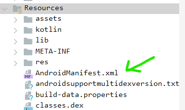

# <u>Prerequisites</u>
- Basic understanding of java and android activity lifecycles
- jadx-gui installed
- apktool
- ghidra or any other decompiler
# <u>Jadx</u> 
## <u>Windows</u>
Install the .exe file from the releases of the [jadx github](https://github.com/skylot/jadx/releases)

## <u>Linux based distro's</u>
Command to install:- `sudo apt install jadx`
Most used will be `jadx-gui apkname.apk`
Other commands you can check using `jadx-gui -h` or `jadx -h`

To understand what an apk does we need to check out the code. We reverse the code of the apk using `jadx`. 

## <u>Steps to reverse the apk</u>
- Open `jadx`
- Select the apk from the folder it is in
- When the apk loads into jadx, click on `Tools->Decompile all classes`
And we are good to go.

Now what's the point of reversing the apk if we don't know where the code starts its execution when we run the app. Here you need to know a bit about android files and lifecycles.

# <u>Android Basics</u>
Each android app will have an `AndroidManifest.xml` file. This is a basic summary of what activities your app has and what permissions it requires.

We first go to `AndroidManifest.xml` under `Resources` in jadx.



Now, every android app starts executing from a specified class known as `MainActivity`. You can search this in `AndroidManifest.xml` and double click on it to go to the class.
```xml
<activity android:name="b3nac.injuredandroid.MainActivity">
            <intent-filter>
                <action android:name="android.intent.action.MAIN"/>
                <category android:name="android.intent.category.LAUNCHER"/>
            </intent-filter>
        </activity>
```

Now in the decompiled `ManinActivity` class, find the `onCreate` method. The `onCreate` method is the first method to be executed in any activity. Other methods or activities are called from here.

From here on its your reversing skills that come into play.

# <u>Apktool</u>
This is a very useful tool which is used to disassemble and get all the files present in an apk. You won't have the java class files, instead you would have `smali (A type of assembly language for Dalvik Virtual Machine)` files. 

Check out how to install it [here](https://apktool.org/docs/install)

It's useful when you have to reverse a `native library`(read more [here](https://www.baeldung.com/jni)) used in the app or patch any function(U have to change the smali code) and rebuild the apk.

Command to decompile the apk :- `apktool appname.apk`
This command will disassemble your app and you will have the files in a folder with the same name as the app in the same directory.

# <u>Native Library</u>
You can find the native libraries in `lib` folder(If the app uses any). Same library will be there for different architectures. You can choose one and decompile it using `ghidra`(or any other decompiler) and read the functions which are necessary for you.
# Rebuilding and signing an Apk
## Steps for signing an apk after patching 

### Manual process
<b>Rebuild the app:-</b> `apktool b <decompiled_app_folder>`

<b>Get the key for signing:-</b> `keytool -genkeypair -alias myalias -keyalg RSA -keysize 2048 -validity 10000 -keystore mykeystore.jks`

**Sign the APK with Jarsigner:-** `jarsigner -verbose -sigalg SHA1withRSA -digestalg SHA1 -keystore mykeystore.jks myapp.apk myalias`

**Optimize the APK with Zipalign :-** `zipalign -v 4 myapp.apk myapp-aligned.apk`

**Verify the Signature :-** `jarsigner -verify -verbose myapp-aligned.apk`

Read in detail :- https://aditya-chauhan17.medium.com/how-to-manually-sign-apks-with-keytool-jarsigner-zipalign-a29503bf97d7


### Automated
Use the tool `uber-apk-signer` by `patrickfav`. Here is the [github](https://github.com/patrickfav/uber-apk-signer) link. Very nice documentation is there.