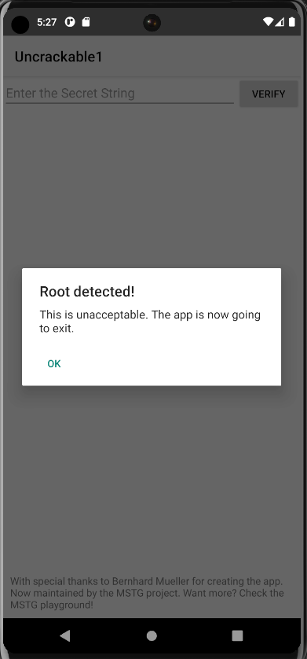
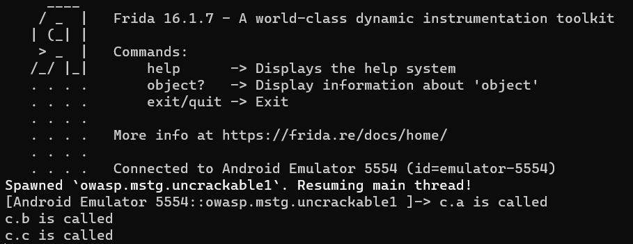
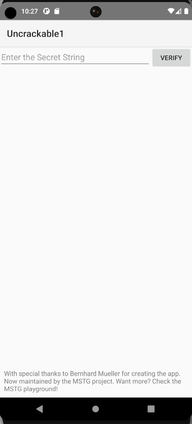
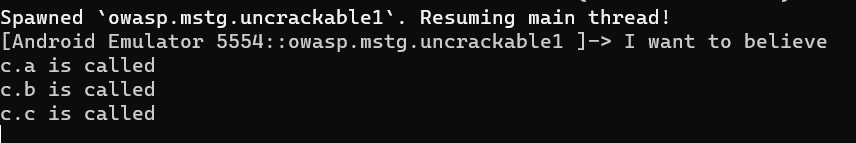

First decompile the apk file using jadx-gui. Inside decompile all the classes under tools. 

We check the `MainActivity` of this apk `sg.vantagepoint.uncrackable1`.
We also open the apk on our emulator or any phone you are using. I am using an emulator here. On trying to open we see `root detected`.


Now in the code, we see in the `OnCreate` function the **root check** happens. 
```java
 protected void onCreate(Bundle bundle) {
        if (c.a() || c.b() || c.c()) { // <- Here
            a("Root detected!");
        }
        if (b.a(getApplicationContext())) {
            a("App is debuggable!");
        }
        super.onCreate(bundle);
        setContentView(R.layout.activity_main);
    }

```
We open the functions in the class `c`.
```java
package sg.vantagepoint.a;

import android.os.Build;
import java.io.File;

/* loaded from: classes.dex */
public class c {
    public static boolean a() {
        for (String str : System.getenv("PATH").split(":")) {
            if (new File(str, "su").exists()) {
                return true;
            }
        }
        return false;
    }

    public static boolean b() {
        String str = Build.TAGS;
        return str != null && str.contains("test-keys");
    }

    public static boolean c() {
        for (String str : new String[]{"/system/app/Superuser.apk", "/system/xbin/daemonsu", "/system/etc/init.d/99SuperSUDaemon", "/system/bin/.ext/.su", "/system/etc/.has_su_daemon", "/system/etc/.installed_su_daemon", "/dev/com.koushikdutta.superuser.daemon/"}) {
            if (new File(str).exists()) {
                return true;
            }
        }
        return false;
    }
}
```
We see that all the checks return `true` or `false`. To open the app we need to bypass this by being able to return `false`. We will use `frida` to do this.

```js
Java.perform(function(){ // Basic template
    let c = Java.use("sg.vantagepoint.a.c"); 
    c["a"].implementation = function () {
        console.log(`c.a is called`);
        let result=false;
        return result;
    };

    c["b"].implementation = function () {
        console.log(`c.a is called`);
        let result=false;
        return result;
    };

    c["c"].implementation = function () {
        console.log(`c.a is called`);
        let result=false;
        return result;
    };
    })
```
In the above script we are using the package which contains the root detecting functions and naming the variable as `c`.
`c["a"].implementation` - It means that under package stored in `c` we are writing a new implementation for the function `a`.
Inside the implementation we just return `false`. We do the same thing for the other 2 functions as well.

We now start our `frida-server` (If you don't know how to do that check [Frida setup](obsidian://open?vault=Android&file=Setup%20Frida)) and in the folder where we wrote our script we will execute the following command in cmd:
`frida -U -f owasp.mstg.uncrackable1 -l lvl1.js`

And the app opens up

Now coming to the next stage. We need to find the Secret String.
We check the `verify` function
```java
    public void verify(View view) {
        String str;
        String obj = ((EditText) findViewById(R.id.edit_text)).getText().toString();
        AlertDialog create = new AlertDialog.Builder(this).create();
        if (a.a(obj)) {  // This check condition
            create.setTitle("Success!");
            str = "This is the correct secret.";
        } else {
            create.setTitle("Nope...");
            str = "That's not it. Try again.";
        }
        create.setMessage(str);
        create.setButton(-3, "OK", new DialogInterface.OnClickListener() { // from class: sg.vantagepoint.uncrackable1.MainActivity.2
            @Override // android.content.DialogInterface.OnClickListener
            public void onClick(DialogInterface dialogInterface, int i) {
                dialogInterface.dismiss();
            }
        });
        create.show();
    }
```
There is a check condition `if(a.a(obj))`. We enter our string and it gets passed to that function. Lets check the function `a.a(obj)`.
```java
package sg.vantagepoint.uncrackable1;

import android.util.Base64;
import android.util.Log;
/* loaded from: classes.dex */
public class a {
    public static boolean a(String str) {
        byte[] bArr;
        byte[] bArr2 = new byte[0];
        try {
            bArr = sg.vantagepoint.a.a.a(b("8d127684cbc37c17616d806cf50473cc"), Base64.decode("5UJiFctbmgbDoLXmpL12mkno8HT4Lv8dlat8FxR2GOc=", 0));
        } catch (Exception e) {
            Log.d("CodeCheck", "AES error:" + e.getMessage());
            bArr = bArr2;
        }
        return str.equals(new String(bArr));
    }

    public static byte[] b(String str) {
        int length = str.length();
        byte[] bArr = new byte[length / 2];
        for (int i = 0; i < length; i += 2) {
            bArr[i / 2] = (byte) ((Character.digit(str.charAt(i), 16) << 4) + Character.digit(str.charAt(i + 1), 16));
        }
        return bArr;
    }
}
```
We have two options here. Either we can write the corresponding java program and print the value its comparing with our string or make `Frida` do the job for us with some commands. We add the following code to our previous script.
```js
    let android=Java.use("android.util.Base64");
    let ab=Java.use("sg.vantagepoint.uncrackable1.a");
    var key=ab.b("8d127684cbc37c17616d806cf50473cc");
    var secret=android.decode("5UJiFctbmgbDoLXmpL12mkno8HT4Lv8dlat8FxR2GOc=", 0);
    let final=Java.use("sg.vantagepoint.a.a");
    var ans=final.a(key,secret);
    var result=""
    for(var i=0;i<ans.length;i++){
        result+=String.fromCharCode(ans[i]);
    }
    console.log(result)
```
We basically replicating the functions in the manner the code is doing and at the end we are converting the bytes array into string and printing the ans.

We run the whole script again using the previous command and we get the secret string.

Hence the secret string: `I want to believe`
We put this in the app and get the success message.