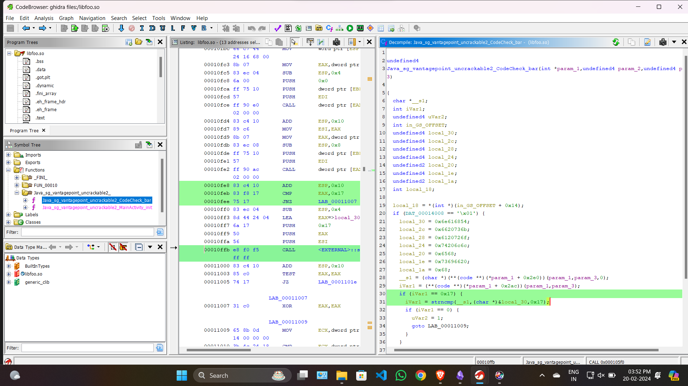
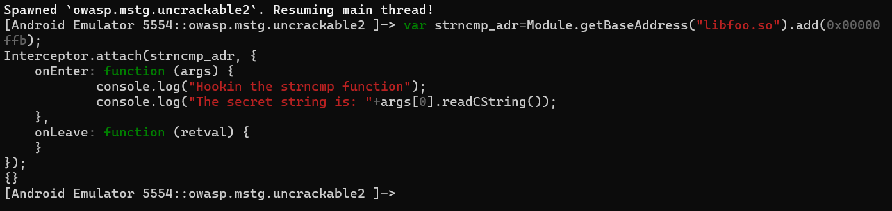
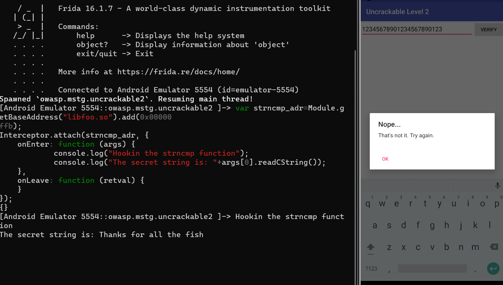

First decompile the apk file using jadx-gui. Inside decompile all the classes under tools.
The same root detection is there in this app as the previous one. You can bypass it the same way as the previous one using `frida`.  Be sure to change the package name and class name accordingly. Check out the writeup for the previous app [here](https://irregular-25.vercel.app/posts/uncrackable-lvl-1/solution/).

Now we check the `verify` function in `MainActivity`
```java
if (this.m.a(obj)) {
            create.setTitle("Success!");
            str = "This is the correct secret.";
        }
```
We go to the function `m.a()`
```java
package sg.vantagepoint.uncrackable2;
/* loaded from: classes.dex */
public class CodeCheck {
    private native boolean bar(byte[] bArr);

    public boolean a(String str) {
        return bar(str.getBytes());
    }
}
```
Here we see that `a` is using a native function which is present in the native library `foo`. You can see that the app is loading the `foo` library in the `MainActivity`
```java
    static {
        System.loadLibrary("foo");
    }
```
Now we should decompile the libfoo.so file which is present in `Resources/lib`
We first get all the files by disassembling the apk using `apktool`. You have apktool in your system. In the folder where you have the apk, open the terminal and type `apktool UnCrackable-Level2.apk`. You will get all the internal files inside a folder named the same. I will choose the x86 library, as the emulator I am working is x86 architecture. Now decompile the native library using `Ghidra`.


We see that in the function `bar`, in the portion I have highlighted, it is checking whether our input is of length `23` and then it compares our input with some constant string. **Our goal is to get that constant string**

Now this can be done in many ways. I will discuss only 1 approach here. We are going to hook into that particular address of `strncmp` where the comparison with the constant string is happening.

So, we need the `base address` of the `libfoo.so` and we add the offset of that particular function to it and we get the address of that comparison.

`Ghidra` always starts its decompilation from a base address `0x00010000`. We subtract the address of that line from this address to get the offset.
`offset = 0x00010ffb - 0x00010000 = 0x00000ffb`

We will now use the frida API `Module.getBaseAdress()` to get the base address of `libfoo.so` when the app starts.

We write a script with a basic template to intercept within the function :-
```js
var strncmp_adr=Module.getBaseAddress("libfoo.so").add(0x00000ffb);
Interceptor.attach(strncmp_adr, {
    onEnter: function (args) {
            console.log("Hookin the strncmp function");
            console.log("The secret string is: "+args[0].readCString());
    },
    onLeave: function (retval) {
    }
});
```

`var strncmp_adr=Module.getBaseAddress("libfoo.so").add(0x00000ffb)`: We are storing the address of the function we want to intercept.
`Interceptor.attach(strncmp_adr,{`: We pass the address to the `Inteceptor.attach`. 
```js
onEnter: function (args) {
            console.log("Hookin the strncmp function");
            console.log("The secret string is: "+args[0].readCString());
}
```
`onEnter`: What it means is that when we enter the function, the things that should be done along with the general execution. `args` is the array of inputs being passed.

console.log of `args[0]` will give us the string.

`onLeave: function (retval)`: As we have nothing to do with the return value, we leave it empty.

Lets run it after we have loaded the initial root bypass script


Now we open the emulator and enter random things which will result in a string of length `23` and click on verify. We get the secret string after that.



Secret string: `Thanks for all the fish`