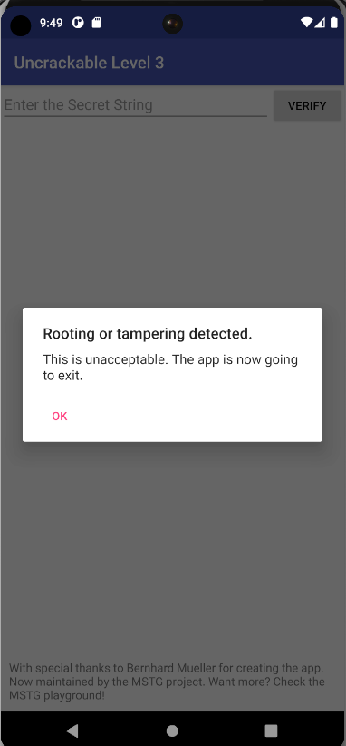
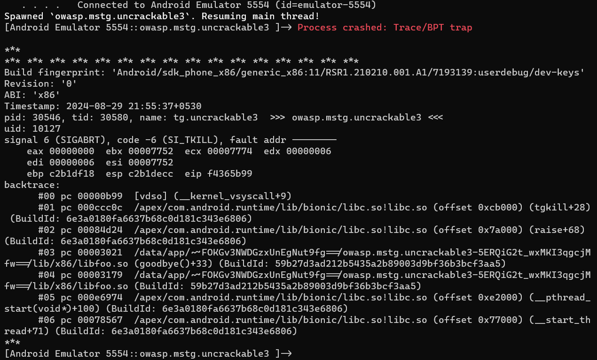
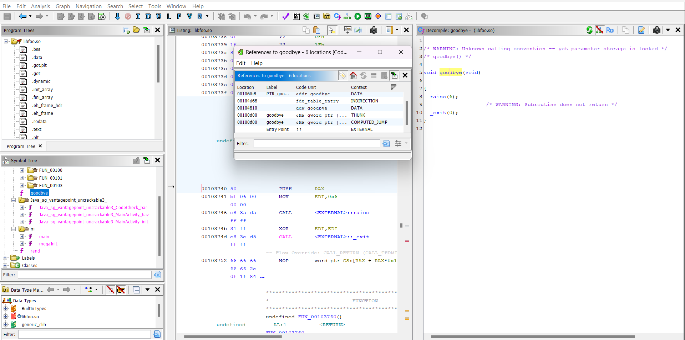
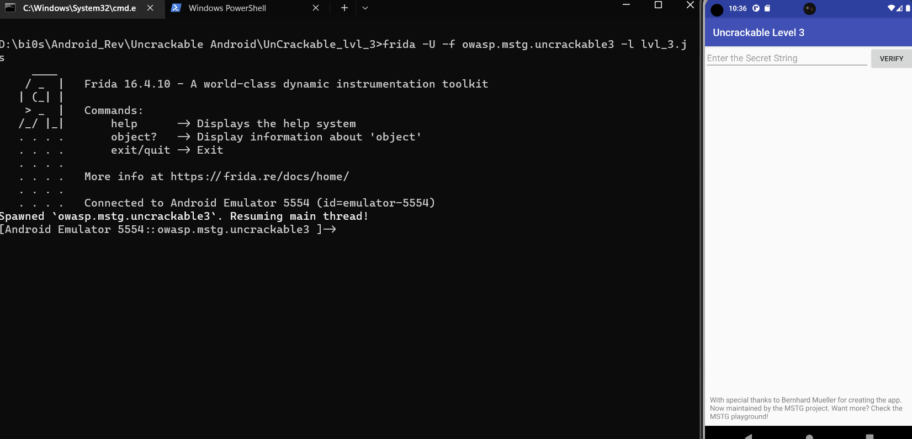
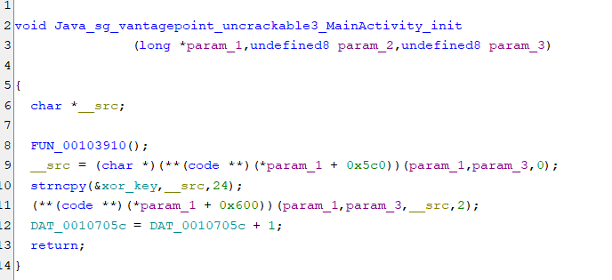
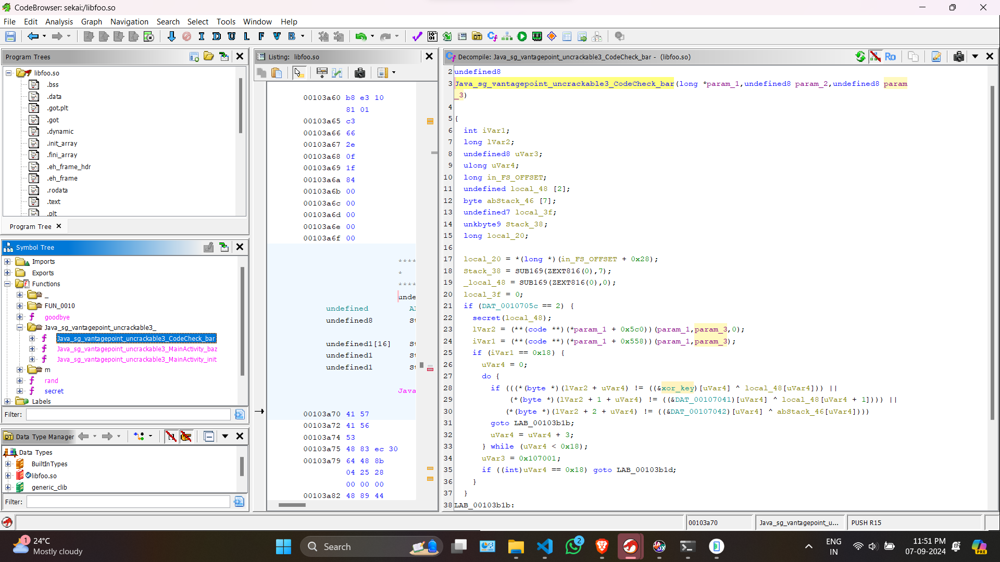
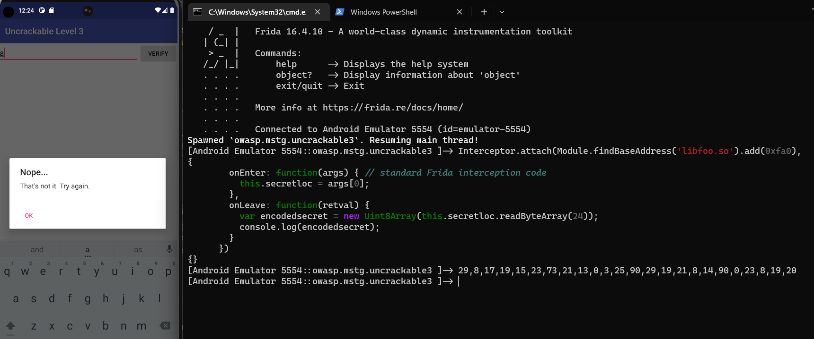
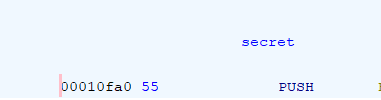
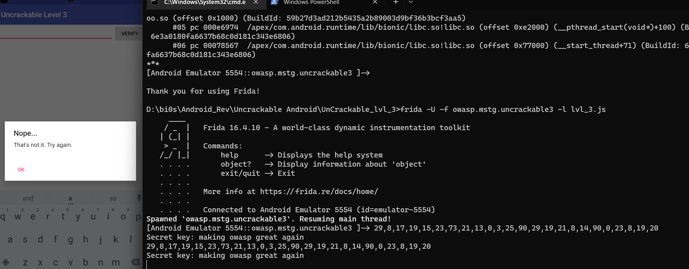

On trying to run the apk on emulator the same root detected page shows up.


Decompile the apk file using jadx-gui. Inside decompile all the classes under tools.
The same root detection is there in this app as the previous one. You can bypass it the same way as the previous one using `frida`.  Be sure to change the package name and class name accordingly. Check out the writeup for the previous app [here](https://irregular-25.vercel.app/posts/uncrackable-lvl-1/solution/).

Our initial root bypass code:-
```js
Java.perform(function(){
    let c = Java.use("sg.vantagepoint.util.RootDetection");
    c["checkRoot1"].implementation = function () {
        return false
    };

    c["checkRoot2"].implementation = function () {
        return false;
    };

    c["checkRoot3"].implementation = function () {
        return false;
    };
})
```

Start `frida-server` on the emulator and we run our initial bypass script using the command:
`frida -U -f owasp.mstg.uncrackable3 -l lvl3.js`

When this commands executes, the app starts for a while and then crashes and we get the following error message.

It is seen that the app crashes at `goodbye()+33` in `libfoo.so`. `libfoo.so` is a native library which is being called in the app.

```java
static {
        System.loadLibrary("foo");
    }
```
You can check it in the `MainActivity.java` in the package `sg.vantagepoint.uncrackable3` which is the starting point of the apk.

Decompile `libfoo.so` using ghidra(or any decompiler of your choice).



Click on the `goodbye` function and lets find out where is it getting called from.
Right click on the `goodbye` in the pseudocode and click `References -> Find References to goodbye` and we see the above screen.

It is clearly seen that there is a computed jump from `goodbye` itself. Click on that particular reference and a similar yet a slightly different pseudocode will appear.

Follow the same steps as above, the only difference this time being we will be searching the reference to the actual address of `goodbye` which is `0x00100d00`.

An `unconditional call` is done on the function. Click on that and we will be taken to the function and the place from where the apk starts to crash.

```c
void FUN_001037c0(void)
{
  FILE *__stream;
  char *pcVar1;
  long in_FS_OFFSET;
  pthread_t pStack_248;
  long lStack_240;
  char acStack_238 [520];
  
  lStack_240 = 0x1037e4;
  __stream = fopen("/proc/self/maps","r");
  if (__stream == (FILE *)0x0) {
LAB_0010386c:
    pcVar1 = "Error opening /proc/self/maps! Terminating...";
  }
  else {
    do {
      while( true ) {
        lStack_240 = 0x103820;
        pcVar1 = fgets(acStack_238,0x200,__stream);
        if (pcVar1 != (char *)0x0) break;
        lStack_240 = 0x10384f;
        fclose(__stream);
        lStack_240 = 0x103859;
        usleep(500);
        lStack_240 = 0x103864;
        __stream = fopen("/proc/self/maps","r");
        if (__stream == (FILE *)0x0) goto LAB_0010386c;
      }
      lStack_240 = 0x103830;
      pcVar1 = strstr(acStack_238,"frida"); // Hereeeeeeee
      if (pcVar1 != (char *)0x0) break;
      lStack_240 = 0x103840;
      pcVar1 = strstr(acStack_238,"xposed");
    } while (pcVar1 == (char *)0x0);
    pcVar1 = "Tampering detected! Terminating...";
  }
  lStack_240 = 0x103896;
  __android_log_print(2,"UnCrackable3",pcVar1);
  lStack_240 = 0x10389b;
  goodbye();
  lStack_240 = *(long *)(in_FS_OFFSET + 0x28);
  pthread_create(&pStack_248,(pthread_attr_t *)0x0,FUN_001037c0,(void *)0x0);
  Ram0000000000107050 = SUB169(ZEXT816(0),7);
  _DAT_00107040 = SUB169(ZEXT816(0),0);
  _DAT_00107049 = 0;
  DAT_0010705c = DAT_0010705c + 1;
  if (*(long *)(in_FS_OFFSET + 0x28) != lStack_240) {
                    /* WARNING: Subroutine does not return */
    __stack_chk_fail();
  }
  return;
}
```

This is the decompiled code. The most suspicious line here is `pcVar1 = strstr(acStack_238,"frida");`. `strstr` basically finds out the occurrence of a particular substring in a string and returns its position. This is what is causing the crash in out app. To bypass this, lets find out the location of the `strstr` by using Frida's API `findExportByName` which will find out address of the function from its library. It is known that all standard c functions reside in `libc.so`. We then use the `Interceptor` API to hook to the function and return `0` when the word `frida` occurs.
```js
Java.perform(function(){
    Interceptor.attach(Module.findExportByName("libc.so","strstr"), {
      onEnter: function(args){
        this.detectfrida = 0;
        if(args[0].readUtf8String().indexOf("frida") != -1){
          this.detectfrida = 1;
        }
        else{
          this.detectfrida = 0;
        }
      },
      onLeave: function(retval){
        if(this.detectfrida == 1){
          retval.replace(0);
        }
      }
    });
    
    let c = Java.use("sg.vantagepoint.util.RootDetection");
    c["checkRoot1"].implementation = function () {
        return false
    };

    c["checkRoot2"].implementation = function () {
        return false;
    };

    c["checkRoot3"].implementation = function () {
        return false;
    };

})
```

Lets try to load this code into our app.


Thus, we bypass the root and tamper checks.

Next we check the `onCreate` function of `MainActivity`.
```java
public void onCreate(Bundle bundle) {
        verifyLibs();
        init(xorkey.getBytes());
        .....
```

We see that the `xorkey` is getting passed to the native function `init`.

Decompile the native library `libfoo.so` and lets check the function



Basically it copies the `xorkey` present in the app, to a variable. I renamed the variable for ease.

Next lets check the `Verify` function.
```java
public void verify(View view) {
        String obj = ((EditText) findViewById(owasp.mstg.uncrackable3.R.id.edit_text)).getText().toString();
        AlertDialog create = new AlertDialog.Builder(this).create();
        if (this.check.check_code(obj)) {
            create.setTitle("Success!");
            create.setMessage("This is the correct secret.");
        } else {
            create.setTitle("Nope...");
            create.setMessage("That's not it. Try again.");
        }
        create.setButton(-3, "OK", new DialogInterface.OnClickListener() { // from class: sg.vantagepoint.uncrackable3.MainActivity.3
            @Override // android.content.DialogInterface.OnClickListener
            public void onClick(DialogInterface dialogInterface, int i) {
                dialogInterface.dismiss();
            }
        });
        create.show();
    }
```

It basically takes our input from the app, and then verifies it by passsing it to the `check_code` function.

```java
package sg.vantagepoint.uncrackable3;

/* loaded from: classes.dex */
public class CodeCheck {
    private static final String TAG = "CodeCheck";

    private native boolean bar(byte[] bArr);

    public boolean check_code(String str) {
        return bar(str.getBytes());
    }
}
```

So `check_code` inturn sends the data to the native function `bar`.

Lets check the code of `bar`.


It basically checks if our input is same as the xored value of `xor_key` and `local_48`. Now `local_48` is generated from the `secret` function. We needn't worry about reversing that function as we will be dynamically getting the secret value using Frida.

Lets write the Interceptor function for getting the secret value.

```js
function SecretGenerator() {
      Interceptor.attach(Module.findBaseAddress('libfoo.so').add(0xfa0), {
        onEnter: function(args) { // standard Frida interception code
          this.secretloc = args[0];
        },
        onLeave: function(retval) {
          var encodedsecret = new Uint8Array(this.secretloc.readByteArray(24)); //length of secret string is 24. Getting the secret bytes.
          console.log(encodedsecret);
        }
      });
    }
```

Lets test this.
First we load our js code without the above snippet and when the first layer is passed, we add this code and then write something random and then see the result.



We add the offset `0xfa0` as the location of the secret function is that offset from the base address of the binary. I am working on a x86 emulator. If you are using some other emulator be sure to decompile the proper binary for the correct offset.



Now lets write the rest of the code and implement it entirely in our script.

```js
Java.perform(function(){
    Interceptor.attach(Module.findExportByName("libc.so","strstr"), {
      onEnter: function(args){
        this.detectfrida = 0;
        if(args[0].readUtf8String().indexOf("frida") != -1){
          this.detectfrida = 1;
        }
        else{
          this.detectfrida = 0;
        }
      },
      onLeave: function(retval){
        if(this.detectfrida == 1){
          retval.replace(0);
        }
      }
    });

    let c = Java.use("sg.vantagepoint.util.RootDetection");
    c["checkRoot1"].implementation = function () {
        return false
    };

    c["checkRoot2"].implementation = function () {
        return false;
    };

    c["checkRoot3"].implementation = function () {
        return false;
    };

    var xorkey  = "pizzapizzapizzapizzapizz"

    var MainActivity = Java.use("sg.vantagepoint.uncrackable3.MainActivity");
    MainActivity.$init.implementation = function() {   //Default constructor implementation
        this.$init();
        SecretGenerator();
    };

    function xorByteArrays(a1, a2) { // To get the actual secret string
      var i;
      const ret = new Uint8Array(new ArrayBuffer(24));
      for (i = 0; i < 24; i++) {
        ret[i] = a1[i] ^ a2.charCodeAt(i);
      }
      return ret;
    }


    function SecretGenerator() {
      Interceptor.attach(Module.findBaseAddress('libfoo.so').add(0xfa0), {
        onEnter: function(args) {
          this.answerLocation = args[0];
        },
        onLeave: function(retval) {
          var encodedAnswer = new Uint8Array(this.answerLocation.readByteArray(24));
          console.log(encodedAnswer);
          var decodedAnswer = xorByteArrays(encodedAnswer, xorkey);
          console.log("Secret : " + String.fromCharCode.apply(null, decodedAnswer));
        }
      });
    }
})
```

And we have our answer



Secret Key:- `making owasp great again`